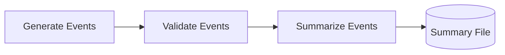

# Lab 7 - Airflow DAG Basics

## Objective

Create a simple Airflow DAG with multiple dependent tasks.

## Scenario

StreamFlow needs orchestration.
Airflow will coordinate when work happens, which task depends on another task, and where to look when something fails.
This lab starts with a small DAG before connecting Airflow to Spark.



## What You Will Build

You will create:

* A local Airflow container.
* A DAG with three tasks.
* A generated event file.
* A summary file created by the DAG.

## Prerequisites

* Docker is running.
* Port `8080` is available.
* You are comfortable with `docker compose up`, `docker compose logs`, and `docker compose down`.

## Suggested Folder

From your lab workspace:

```bash
mkdir -p lab-07-airflow/dags lab-07-airflow/data lab-07-airflow/logs
cd lab-07-airflow
touch docker-compose.yml dags/lab07_basic_pipeline.py
```

## Docker Compose File

Create `docker-compose.yml`:

```yaml
services:
  airflow:
    image: apache/airflow:2.9.3
    container_name: streamflow_lab07_airflow
    ports:
      - "8080:8080"
    environment:
      AIRFLOW__CORE__LOAD_EXAMPLES: "false"
    volumes:
      - ./dags:/opt/airflow/dags
      - ./data:/opt/airflow/data
      - ./logs:/opt/airflow/logs
    command: standalone
```

`airflow standalone` starts the webserver and scheduler in one container.
This is convenient for a lab, but production Airflow usually separates these services.

## DAG File

Create `dags/lab07_basic_pipeline.py`:

```python
import json
from collections import Counter
from pathlib import Path

from airflow.decorators import dag, task
from pendulum import datetime


DATA_DIR = Path("/opt/airflow/data")
EVENTS_PATH = DATA_DIR / "lab07_events.jsonl"
SUMMARY_PATH = DATA_DIR / "lab07_summary.json"


@dag(
    dag_id="lab07_basic_pipeline",
    start_date=datetime(2026, 1, 1),
    schedule=None,
    catchup=False,
    tags=["streamflow", "lab"],
)
def lab07_basic_pipeline():
    @task
    def generate_events():
        DATA_DIR.mkdir(parents=True, exist_ok=True)

        events = [
            {"event_id": "evt_001", "event_type": "page_view", "user_id": "user_101"},
            {"event_id": "evt_002", "event_type": "video_play", "user_id": "user_102"},
            {"event_id": "evt_003", "event_type": "purchase", "user_id": "user_103"},
        ]

        with EVENTS_PATH.open("w", encoding="utf-8") as handle:
            for event in events:
                handle.write(json.dumps(event) + "\n")

        print(f"Wrote {len(events)} events to {EVENTS_PATH}")
        return str(EVENTS_PATH)

    @task
    def validate_events(events_path):
        path = Path(events_path)

        if not path.exists():
            raise FileNotFoundError(f"Missing event file: {path}")

        count = 0

        for line in path.read_text().splitlines():
            event = json.loads(line)

            for field in ["event_id", "event_type", "user_id"]:
                if not event.get(field):
                    raise ValueError(f"Missing required field {field}: {event}")

            count += 1

        print(f"Validated {count} events")
        return events_path

    @task
    def summarize_events(events_path):
        counts = Counter()

        for line in Path(events_path).read_text().splitlines():
            event = json.loads(line)
            counts[event["event_type"]] += 1

        summary = {
            "total_events": sum(counts.values()),
            "events_by_type": dict(counts),
        }

        SUMMARY_PATH.write_text(json.dumps(summary, indent=2), encoding="utf-8")
        print(json.dumps(summary, indent=2))
        return str(SUMMARY_PATH)

    summarize_events(validate_events(generate_events()))


lab07_basic_pipeline()
```

## Start Airflow

```bash
docker compose up -d
```

Watch startup logs:

```bash
docker compose logs -f airflow
```

After Airflow starts, get the admin password:

```bash
docker compose exec airflow cat /opt/airflow/standalone_admin_password.txt
```

Open the UI:

```text
http://localhost:8080
```

Username is usually `admin`.
Use the password from the file above.

## Trigger the DAG

List DAGs:

```bash
docker compose exec airflow airflow dags list
```

Trigger the DAG:

```bash
docker compose exec airflow airflow dags trigger lab07_basic_pipeline
```

Check DAG runs:

```bash
docker compose exec airflow airflow dags list-runs -d lab07_basic_pipeline
```

Inspect generated files:

```bash
ls data
cat data/lab07_summary.json
```

## Checkpoints

You are done when:

* Airflow opens at `http://localhost:8080`.
* `lab07_basic_pipeline` appears in the DAG list.
* The DAG run succeeds.
* `data/lab07_events.jsonl` and `data/lab07_summary.json` exist.

## Deliverables

Submit:

* `docker-compose.yml`.
* `dags/lab07_basic_pipeline.py`.
* A screenshot of the successful DAG run or copied CLI output.
* The contents of `data/lab07_summary.json`.
* One paragraph explaining task dependencies in this DAG.

## Common Issues

| Problem | Likely Cause | Fix |
| ------- | ------------ | --- |
| Airflow UI does not load | Container is still starting | Wait 1-2 minutes and check `docker compose logs airflow` |
| DAG does not appear | Python file has an import error | Run `docker compose exec airflow airflow dags list-import-errors` |
| Login password unknown | Password file not checked | Run the `cat /opt/airflow/standalone_admin_password.txt` command |
| Port `8080` is in use | Another web service is running | Change `"8080:8080"` to `"8081:8080"` and open `localhost:8081` |

## Cleanup

When finished:

```bash
docker compose down
```
