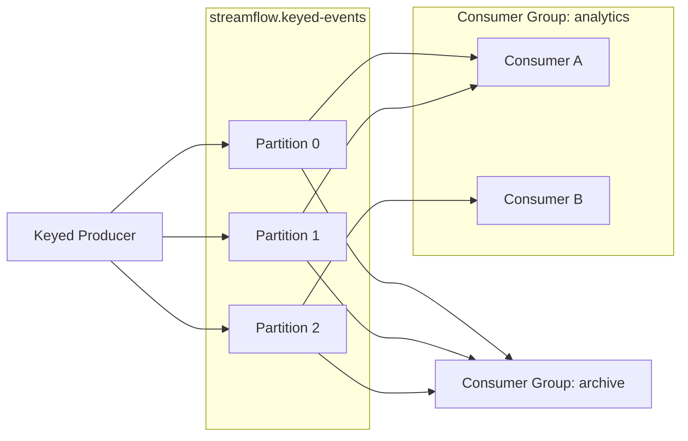

# Lab 13 - Kafka Partitions, Keys, and Consumer Groups

## Objective

Observe how Kafka record keys affect partition selection and how consumer groups divide work and track offsets.

## Scenario

StreamFlow receives events from several users.
Events for one user should stay ordered, while several consumer instances should be able to process the topic in parallel.
In this lab, you will publish keyed records, inspect their partition metadata, run cooperating consumers, and examine committed offsets.



## What You Will Build

You will create:

* A one-broker Kafka environment with a three-partition topic.
* A Python producer that sends keyed JSON events and verifies acknowledgments.
* A configurable Python consumer that prints its group, partition, and offset.
* A small experiment comparing consumers in the same group with consumers in different groups.
* An offset report showing the progress and lag of a consumer group.

## Prerequisites

* Docker is running.
* Python 3.10 or later is installed.
* Lab 2 is complete or its Kafka concepts are familiar.
* Two or three terminal windows are available.

## Suggested Folder

From your lab workspace:

```bash
mkdir -p lab-13-kafka-groups
cd lab-13-kafka-groups
touch docker-compose.yml producer.py consumer.py requirements.txt
```

## Docker Compose File

Create `docker-compose.yml`:

```yaml
services:
  kafka:
    image: bitnami/kafka:3.7
    container_name: streamflow_lab13_kafka
    ports:
      - "9092:9092"
    environment:
      KAFKA_CFG_NODE_ID: 1
      KAFKA_CFG_PROCESS_ROLES: broker,controller
      KAFKA_CFG_CONTROLLER_QUORUM_VOTERS: 1@kafka:9093
      KAFKA_CFG_LISTENERS: PLAINTEXT://:9092,CONTROLLER://:9093
      KAFKA_CFG_ADVERTISED_LISTENERS: PLAINTEXT://localhost:9092
      KAFKA_CFG_CONTROLLER_LISTENER_NAMES: CONTROLLER
      KAFKA_CFG_INTER_BROKER_LISTENER_NAME: PLAINTEXT
      ALLOW_PLAINTEXT_LISTENER: "yes"
```

Start Kafka:

```bash
docker compose up -d
docker compose logs kafka
```

Wait until Kafka finishes starting.

## Create and Inspect the Topic

Create a topic with three partitions:

```bash
docker compose exec kafka kafka-topics.sh \
  --bootstrap-server localhost:9092 \
  --create \
  --topic streamflow.keyed-events \
  --partitions 3 \
  --replication-factor 1
```

List and describe it:

```bash
docker compose exec kafka kafka-topics.sh \
  --bootstrap-server localhost:9092 \
  --list

docker compose exec kafka kafka-topics.sh \
  --bootstrap-server localhost:9092 \
  --describe \
  --topic streamflow.keyed-events
```

The topic has three ordered logs. Replication is limited to one because this lab has only one broker.

## Python Environment

Create `requirements.txt`:

```text
kafka-python==2.0.2
```

Create and activate a virtual environment:

```bash
python -m venv .venv
source .venv/Scripts/activate
python -m pip install --upgrade pip
pip install -r requirements.txt
```

## Keyed Producer

Create `producer.py`:

```python
import argparse
import json
from datetime import datetime, timezone

from kafka import KafkaProducer


TOPIC = "streamflow.keyed-events"
USERS = ["user_101", "user_102", "user_103", "user_104"]


def parse_args():
    parser = argparse.ArgumentParser()
    parser.add_argument("--rounds", type=int, default=3)
    parser.add_argument("--acks", choices=["1", "all"], default="all")
    return parser.parse_args()


def main():
    args = parse_args()

    producer = KafkaProducer(
        bootstrap_servers="localhost:9092",
        key_serializer=lambda key: key.encode("utf-8"),
        value_serializer=lambda value: json.dumps(value).encode("utf-8"),
        acks=args.acks,
        retries=3,
    )

    for round_number in range(1, args.rounds + 1):
        for user_id in USERS:
            event = {
                "event_id": f"{user_id}_round_{round_number}",
                "event_type": "page_view",
                "user_id": user_id,
                "round": round_number,
                "event_ts": datetime.now(timezone.utc).isoformat(),
            }

            future = producer.send(TOPIC, key=user_id, value=event)
            metadata = future.get(timeout=10)

            print(
                f"event_id={event['event_id']} "
                f"key={user_id} "
                f"partition={metadata.partition} "
                f"offset={metadata.offset}"
            )

    producer.flush()
    producer.close()


if __name__ == "__main__":
    main()
```

Run the producer:

```bash
python producer.py
```

Study its output. Every event for the same user should be assigned to the same partition. Different users may still hash to the same partition.

`send()` is asynchronous, but `future.get()` waits for the broker acknowledgment and returns the stored partition and offset. The producer uses `acks="all"`; in this one-broker lab, that verifies the broker accepted the record but does not provide multi-broker fault tolerance.

## Configurable Consumer

Create `consumer.py`:

```python
import argparse
import json
import time

from kafka import KafkaConsumer


TOPIC = "streamflow.keyed-events"


def parse_args():
    parser = argparse.ArgumentParser()
    parser.add_argument("--group", required=True)
    parser.add_argument("--name", required=True)
    parser.add_argument("--seconds", type=int, default=20)
    return parser.parse_args()


def main():
    args = parse_args()

    consumer = KafkaConsumer(
        TOPIC,
        bootstrap_servers="localhost:9092",
        group_id=args.group,
        auto_offset_reset="earliest",
        enable_auto_commit=True,
        auto_commit_interval_ms=1000,
        key_deserializer=(
            lambda key: key.decode("utf-8") if key is not None else None
        ),
        value_deserializer=lambda value: json.loads(value.decode("utf-8")),
    )

    deadline = time.monotonic() + args.seconds
    count = 0

    while time.monotonic() < deadline:
        records = consumer.poll(timeout_ms=1000)

        for messages in records.values():
            for message in messages:
                count += 1
                print(
                    f"consumer={args.name} "
                    f"group={args.group} "
                    f"key={message.key} "
                    f"partition={message.partition} "
                    f"offset={message.offset} "
                    f"event_id={message.value['event_id']}"
                )

    consumer.commit()
    consumer.close()
    print(f"consumer={args.name} read={count}")


if __name__ == "__main__":
    main()
```

The explicit final `commit()` makes the experiment easier to observe. Production applications need a carefully designed commit strategy tied to successful processing.

## Experiment 1 - One Consumer Group Shares Work

Open two terminals in the lab directory and activate the virtual environment in each.

Start consumer A:

```bash
python consumer.py --group analytics --name consumer-a --seconds 30
```

Quickly start consumer B in the second terminal:

```bash
python consumer.py --group analytics --name consumer-b --seconds 30
```

While both are running, publish more records from a third terminal:

```bash
python producer.py --rounds 5
```

Compare the two consumer outputs:

* The consumers should receive different partitions.
* A partition belongs to only one active consumer in the group at a time.
* Together, the group processes the topic once.
* Kafka may rebalance when the second consumer joins or either consumer exits.

Because there are three partitions and only two consumers, one consumer can own two partitions.

## Inspect Consumer Group Offsets

After the consumers finish, run:

```bash
docker compose exec kafka kafka-consumer-groups.sh \
  --bootstrap-server localhost:9092 \
  --describe \
  --group analytics
```

Important columns include:

| Column | Meaning |
| ------ | ------- |
| `PARTITION` | Topic partition |
| `CURRENT-OFFSET` | Group's next committed read position |
| `LOG-END-OFFSET` | Broker's next append position |
| `LAG` | Records not yet reflected in the committed group position |

Run the same group again:

```bash
python consumer.py --group analytics --name consumer-c --seconds 10
```

It should not replay records already committed by the `analytics` group. `auto_offset_reset="earliest"` only applies when the group has no valid committed offset.

## Experiment 2 - A Different Group Reads Independently

Use a new group ID:

```bash
python consumer.py --group archive --name archive-a --seconds 15
```

The `archive` group should read the retained history from the beginning because it has no committed offsets. This demonstrates Kafka's pub/sub behavior across groups.

Inspect both groups:

```bash
docker compose exec kafka kafka-consumer-groups.sh \
  --bootstrap-server localhost:9092 \
  --list
```

## Experiment 3 - More Consumers Than Partitions

Optional challenge: start four consumers with the same new group ID and then publish records.

```bash
python consumer.py --group oversized --name consumer-1 --seconds 30
```

Repeat with names `consumer-2`, `consumer-3`, and `consumer-4` in separate terminals.
Because the topic has only three partitions, at least one consumer will have no partition assignment and will remain idle.

## Checkpoints

You are done when:

* The topic description shows three partitions.
* Producer output proves each user key stays on one partition.
* Two `analytics` consumers split partitions rather than both reading every record.
* The consumer-group command displays committed offsets and lag.
* A restarted `analytics` consumer does not replay committed records.
* A new `archive` group reads the retained history independently.

## Deliverables

Submit:

* `docker-compose.yml`.
* `requirements.txt`.
* `producer.py` and `consumer.py`.
* Producer output showing keys, partitions, and offsets.
* Output from both consumers in the `analytics` group.
* Output from `kafka-consumer-groups.sh --describe`.
* A short explanation of the difference between a partition offset and a committed group offset.
* A short explanation of why record keys matter.

## Reflection Questions

* Why is ordering guaranteed only within one partition?
* What limits the number of active consumers that can usefully share one consumer group?
* Why did the `archive` group see records already processed by `analytics`?
* Why did `earliest` not cause the restarted `analytics` consumer to replay everything?
* What additional infrastructure would make `acks="all"` fault tolerant?
* How would duplicate processing affect a non-idempotent downstream database write?

## Common Issues

| Problem | Likely Cause | Fix |
| ------- | ------------ | --- |
| `NoBrokersAvailable` | Kafka has not finished starting | Wait and inspect `docker compose logs kafka` |
| One consumer reads all records | Second consumer joined too late or the first finished | Start both for 30 seconds, then run the producer |
| Consumer reads zero records | Its group already committed the available offsets | Produce new records or use a new group ID |
| User appears in multiple partitions | Producer omitted or changed the key | Verify `key=user_id` is passed to `send()` |
| Group is not listed | Consumer never joined or offsets were not committed | Let it poll, exit normally, and inspect again |
| One of four consumers is idle | Topic has only three partitions | This is expected for the optional experiment |

## Cleanup

When finished:

```bash
docker compose down
deactivate
```
