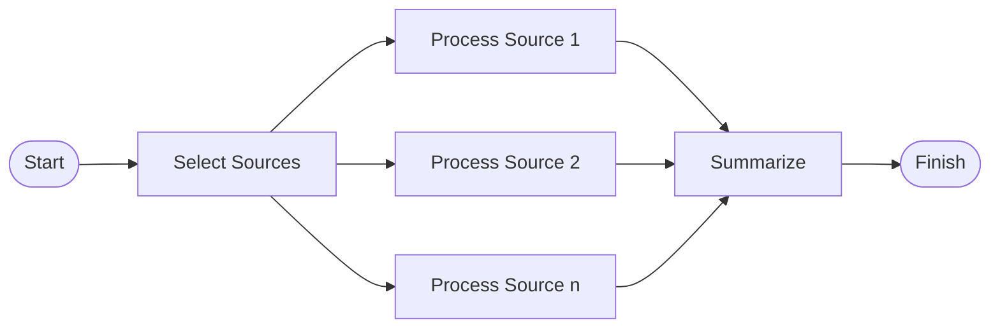

# Lab 14 - Airflow Parameters, Dynamic Tasks, Connections, and Hooks

## Objective

Build a parameterized Airflow DAG that dynamically maps tasks and uses an Airflow connection through a custom hook.

## Scenario

StreamFlow processes events from several sources.
An operator should be able to select the sources and minimum event count when triggering a run, while deployment-specific storage configuration remains outside the DAG logic.

In this lab, runtime parameters choose the work, dynamic task mapping creates one task instance per source, and an Airflow connection tells a custom hook where source data is stored.

## What You Will Build

You will create:

* A local Airflow environment.
* A generic Airflow connection containing a data directory and allowed source names.
* A custom hook that reads and validates that connection.
* A DAG with validated runtime parameters.
* Dynamically mapped tasks with fan-out and fan-in dependencies.
* A combined JSON summary from the mapped task results.

## Prerequisites

* Docker is running.
* Port `8080` is available.
* Lab 7 is complete or basic DAG concepts are familiar.

## Suggested Folder

From your lab workspace:

```bash
mkdir -p lab-14-airflow-dynamic/dags
mkdir -p lab-14-airflow-dynamic/data
mkdir -p lab-14-airflow-dynamic/logs
cd lab-14-airflow-dynamic
touch docker-compose.yml dags/lab14_dynamic_sources.py
```

## Docker Compose File

Create `docker-compose.yml`:

```yaml
services:
  airflow:
    image: apache/airflow:2.9.3
    container_name: streamflow_lab14_airflow
    ports:
      - "8080:8080"
    environment:
      AIRFLOW__CORE__LOAD_EXAMPLES: "false"
    volumes:
      - ./dags:/opt/airflow/dags
      - ./data:/opt/airflow/data
      - ./logs:/opt/airflow/logs
    command: standalone
```

Start Airflow:

```bash
docker compose up -d
docker compose logs -f airflow
```

Allow Airflow to finish starting, then press `Ctrl+C` to stop following the logs.

## Create the Airflow Connection

Create a generic connection named `streamflow_sources`:

```bash
docker compose exec airflow airflow connections add streamflow_sources \
  --conn-type generic \
  --conn-host /opt/airflow/data \
  --conn-extra '{"allowed_sources":["web","mobile","partner"]}'
```

Confirm that it exists:

```bash
docker compose exec airflow airflow connections get streamflow_sources
```

The connection has two responsibilities:

* `host` stores the environment-specific data directory.
* `extra` stores a JSON list of allowed sources.

Do not put real secrets in screenshots or copied terminal output. This lab connection contains no secret values.

## DAG, Custom Hook, and Dynamic Tasks

Create `dags/lab14_dynamic_sources.py`:

```python
import json
from pathlib import Path

from airflow.decorators import dag, task
from airflow.exceptions import AirflowException
from airflow.hooks.base import BaseHook
from airflow.models.param import Param
from airflow.operators.empty import EmptyOperator
from airflow.operators.python import get_current_context
from pendulum import datetime


CONNECTION_ID = "streamflow_sources"
SUMMARY_NAME = "lab14_summary.json"


class StreamFlowSourceHook(BaseHook):
    conn_name_attr = "streamflow_conn_id"
    default_conn_name = CONNECTION_ID
    conn_type = "generic"
    hook_name = "StreamFlow Source"

    def __init__(self, streamflow_conn_id=default_conn_name):
        super().__init__()
        self.streamflow_conn_id = streamflow_conn_id

    def get_config(self):
        connection = self.get_connection(self.streamflow_conn_id)
        allowed_sources = connection.extra_dejson.get("allowed_sources", [])

        if not connection.host:
            raise AirflowException("Connection host must contain a data directory")

        if not allowed_sources:
            raise AirflowException("Connection extra must define allowed_sources")

        return Path(connection.host), set(allowed_sources)


@dag(
    dag_id="lab14_dynamic_sources",
    start_date=datetime(2026, 1, 1),
    schedule=None,
    catchup=False,
    params={
        "sources": Param(
            ["web", "mobile"],
            type="array",
            items={"type": "string"},
            minItems=1,
        ),
        "minimum_count": Param(2, type="integer", minimum=1, maximum=20),
    },
    tags=["streamflow", "dynamic", "lab"],
)
def lab14_dynamic_sources():
    start = EmptyOperator(task_id="start")

    @task
    def select_sources():
        context = get_current_context()
        requested_sources = context["params"]["sources"]

        data_dir, allowed_sources = StreamFlowSourceHook().get_config()
        invalid_sources = sorted(set(requested_sources) - allowed_sources)

        if invalid_sources:
            raise AirflowException(
                f"Sources are not allowed by {CONNECTION_ID}: {invalid_sources}"
            )

        data_dir.mkdir(parents=True, exist_ok=True)
        return sorted(set(requested_sources))

    @task
    def process_source(source):
        context = get_current_context()
        minimum_count = context["params"]["minimum_count"]
        data_dir, _ = StreamFlowSourceHook().get_config()

        events = [
            {
                "event_id": f"{source}_{index:03d}",
                "event_type": "page_view",
                "source": source,
            }
            for index in range(1, minimum_count + 1)
        ]

        output_path = data_dir / f"lab14_{source}_events.jsonl"

        with output_path.open("w", encoding="utf-8") as handle:
            for event in events:
                handle.write(json.dumps(event) + "\n")

        result = {
            "source": source,
            "event_count": len(events),
            "output_path": str(output_path),
        }
        print(json.dumps(result, indent=2))
        return result

    @task
    def summarize(results):
        data_dir, _ = StreamFlowSourceHook().get_config()
        ordered_results = sorted(results, key=lambda result: result["source"])

        summary = {
            "source_count": len(ordered_results),
            "total_events": sum(
                result["event_count"] for result in ordered_results
            ),
            "sources": ordered_results,
        }

        summary_path = data_dir / SUMMARY_NAME
        summary_path.write_text(
            json.dumps(summary, indent=2),
            encoding="utf-8",
        )
        print(json.dumps(summary, indent=2))
        return str(summary_path)

    selected_sources = select_sources()
    mapped_results = process_source.expand(source=selected_sources)
    summary_path = summarize(mapped_results)

    start >> selected_sources
    summary_path >> EmptyOperator(task_id="finish")


lab14_dynamic_sources()
```

## Understand the Design

The workflow contains these stages:



Important details:

* `params` validates trigger-time inputs.
* `select_sources` returns a runtime list.
* `process_source.expand(...)` creates one mapped task instance per selected source.
* `summarize` automatically waits for every mapped task and receives their small result dictionaries.
* `StreamFlowSourceHook` reads configuration through the connection ID.
* XCom carries only source summaries and paths, not event datasets.
* Sorting makes generated output deterministic.

## Check the DAG

List import errors:

```bash
docker compose exec airflow airflow dags list-import-errors
```

List DAGs:

```bash
docker compose exec airflow airflow dags list
```

If the DAG is paused, unpause it:

```bash
docker compose exec airflow airflow dags unpause lab14_dynamic_sources
```

## Trigger with Default Parameters

Trigger the DAG:

```bash
docker compose exec airflow airflow dags trigger lab14_dynamic_sources
```

Check the run:

```bash
docker compose exec airflow airflow dags list-runs \
  -d lab14_dynamic_sources
```

The default parameters should create mapped tasks for `web` and `mobile`, with two events from each source.

Inspect the host-mounted output:

```bash
ls data
cat data/lab14_summary.json
```

Expected summary values:

```json
{
  "source_count": 2,
  "total_events": 4
}
```

The real file also includes details for each source.

## Trigger with Custom Parameters

Trigger a run for three sources with four events each:

```bash
docker compose exec airflow airflow dags trigger lab14_dynamic_sources \
  --conf '{"sources":["web","mobile","partner"],"minimum_count":4}'
```

After the run succeeds, the summary should report:

```text
source_count = 3
total_events = 12
```

## Explore the Airflow UI

Get the local admin password:

```bash
docker compose exec airflow \
  cat /opt/airflow/standalone_admin_password.txt
```

Open `http://localhost:8080`, sign in, and open `lab14_dynamic_sources`.

Inspect:

* **Graph view** for fan-out and fan-in dependencies.
* **Grid view** for individual mapped task instances.
* **Task logs** for each source's output.
* **DAG run configuration** for the submitted parameter values.
* **Admin > Connections** for `streamflow_sources`, if your role exposes it.

## Failure Experiment - Invalid Source

Trigger an invalid source:

```bash
docker compose exec airflow airflow dags trigger lab14_dynamic_sources \
  --conf '{"sources":["unknown"],"minimum_count":2}'
```

The `select_sources` task should fail with a clear error. No mapped processing task should run.

This demonstrates the difference between:

* JSON Schema parameter validation, which validates basic types and ranges.
* Business validation, which checks values against configuration obtained through a connection.

## Connection Change Experiment

The DAG code refers only to `streamflow_sources`, not its path or allowed-source list.
To understand the separation, inspect the current connection:

```bash
docker compose exec airflow airflow connections get streamflow_sources
```

In another environment, an administrator could define the same connection ID with a different directory. The DAG code would not need to change.

Do not change or delete the connection until successful runs are complete.

## Checkpoints

You are done when:

* `streamflow_sources` exists and contains a host and extra JSON.
* The DAG imports without errors.
* A default run creates two mapped `process_source` task instances.
* A custom run creates three mapped task instances and twelve total events.
* The fan-in summary waits for all mapped tasks.
* `data/lab14_summary.json` contains the combined result.
* The invalid-source run fails during business validation.
* You can locate parameters, mapped task logs, and dependencies in the UI.

## Deliverables

Submit:

* `docker-compose.yml`.
* `dags/lab14_dynamic_sources.py`.
* Connection output with any sensitive fields removed.
* `data/lab14_summary.json` from the custom run.
* A screenshot of Graph or Grid view showing mapped tasks.
* Logs or a screenshot from the intentional invalid-source failure.
* A short explanation of parameters, dynamic task mapping, connections, hooks, and XCom in this DAG.

## Reflection Questions

* Why is dynamic task mapping better than hardcoding one task per source here?
* Which validation happens before execution, and which validation happens inside a task?
* Why does the DAG refer to a connection ID instead of a literal environment path?
* What does the custom hook contribute beyond calling `BaseHook.get_connection()` everywhere?
* Why are result dictionaries appropriate for XCom while the event files are not?
* What would make each mapped task idempotent if it wrote to a production database?

## Common Issues

| Problem | Likely Cause | Fix |
| ------- | ------------ | --- |
| DAG does not appear | Import or syntax error | Run `airflow dags list-import-errors` |
| Connection already exists | Setup command was run before | Use the existing connection after checking its values |
| Connection not found | It was created in a different Airflow environment | Run the connection command inside this lab's container |
| No mapped tasks appear | `select_sources` failed or returned no values | Inspect its log and submitted parameters |
| Custom trigger fails at CLI | JSON quoting was changed by the shell | Use the exact single-quoted `--conf` example in Git Bash |
| Host output is missing | Connection host does not match the mounted path | Set it to `/opt/airflow/data` |
| Port `8080` is occupied | Another Airflow environment is running | Stop it or map a different host port |

## Cleanup

When finished:

```bash
docker compose down
```
