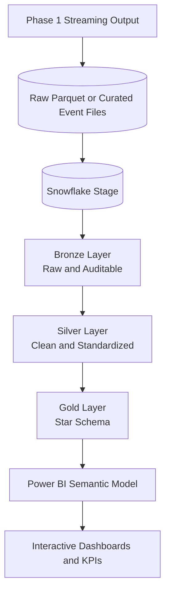
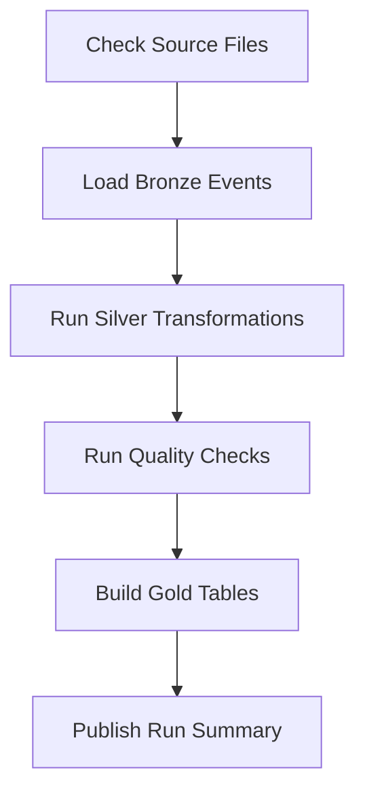

# Project Phase 2

## Project Title

**StreamFlow Phase 2 - Enterprise Analytics Pipeline**

## Application Overview

StreamFlow Phase 2 extends the Phase 1 streaming platform into an analytics-ready warehouse and business intelligence solution.
Raw or curated event data produced by the Phase 1 streaming ingest is loaded into Snowflake, transformed through a Medallion Architecture, modeled into fact and dimension tables, and visualized through Power BI dashboards.

The goal is to show how checkpointed stream output, such as Parquet files written by Spark Structured Streaming, becomes trusted business insight.
Associates should understand not only how to write SQL transformations, but also why warehouse layers, dimensional models, KPIs, and dashboard validation matter.

## Functional Goals

The analytics pipeline will:

* Load Phase 1 stream output into Snowflake.
* Organize data into Bronze, Silver, and Gold layers.
* Preserve raw payloads in the Bronze layer.
* Clean, type-cast, deduplicate, and standardize records in the Silver layer.
* Build analytics-ready fact and dimension tables in the Gold layer for the team's chosen event domain.
* Create business KPIs using SQL and DAX.
* Build interactive Power BI dashboards.
* Orchestrate loading and transformation steps with Airflow.
* Validate record counts and important business rules between layers.

## Core Functional Scope

As an **analytics engineer**, I want to:

1. Load event data from Phase 1 raw Parquet or curated outputs into Snowflake.
2. Keep a raw copy of each event for auditability.
3. Transform raw events into clean, typed tables.
4. Build a star schema for reporting on the selected event domain.
5. Define KPIs such as total events, distinct entities, event rates, conversion/failure rates, or domain-specific measures.
6. Create Power BI dashboards that answer business questions.
7. Schedule or trigger warehouse transformations through Airflow.
8. Validate that data counts reconcile across layers.
9. Document the warehouse design and dashboard logic.

## Objective / Tools Used

* Snowflake
* Medallion Architecture
* SQL Transformations
* Apache Airflow
* Power BI Desktop
* DAX (Data Analysis Expressions)
* Star Schema / Dimensional Modeling
* Data Warehousing Concepts

## Weeks During Training

Weeks 9-11

## Project Type

Group Project

## Learning Outcomes

By the end of this project, associates should be able to:

* Explain the purpose of Bronze, Silver, and Gold data layers.
* Load data into Snowflake tables.
* Write SQL transformations that clean and standardize event data.
* Design fact and dimension tables for reporting.
* Build Power BI dashboards from warehouse tables.
* Write DAX measures for common KPIs.
* Validate data quality and reconcile row counts.
* Explain how raw data becomes analytics-ready data.

## System Architecture Overview

### Data Flow



### Core Layers

| Layer | Responsibility |
| ----- | -------------- |
| **Bronze** | Stores raw or lightly loaded event records with ingestion metadata |
| **Silver** | Cleans, types, deduplicates, and standardizes event data |
| **Gold** | Provides fact and dimension tables for BI reporting on the chosen domain |
| **Power BI** | Visualizes KPIs, trends, and business questions |
| **Airflow** | Coordinates load and transformation jobs |
| **Data Quality Checks** | Validate counts, nulls, duplicates, and business rules |

Phase 2 should inherit the event domain selected in Phase 1.
For example, a team may analyze ecommerce behavior, media engagement, application logs, support tickets, banking-style transactions, or device telemetry.
The warehouse design should use the same event contract instead of forcing every team into a user/purchase model.
Phase 2 does not need to perform continuous warehouse ingestion.
A scheduled or manually triggered load from Phase 1 output files is enough; Snowpipe, Snowflake Streams, and Tasks are stretch goals.

## Example Warehouse Design

### Bronze Layer

| Table | Purpose |
| ----- | ------- |
| `bronze_events_raw` | Stores raw event payloads and load metadata |

Example:

```sql
CREATE TABLE IF NOT EXISTS bronze_events_raw (
  raw_payload VARIANT,
  source_file STRING,
  stream_topic STRING,
  ingest_run_id STRING,
  loaded_at TIMESTAMP_NTZ DEFAULT CURRENT_TIMESTAMP()
);
```

### Silver Layer

| Table | Purpose |
| ----- | ------- |
| `silver_events` | Clean, typed event records |
| `silver_rejected_events` | Records that failed validation |

Example:

```sql
CREATE TABLE IF NOT EXISTS silver_events (
  event_id STRING,
  event_type STRING,
  entity_id STRING,
  event_ts TIMESTAMP_NTZ,
  event_date DATE,
  source STRING,
  payload VARIANT,
  stream_topic STRING,
  ingest_run_id STRING,
  loaded_at TIMESTAMP_NTZ
);
```

### Gold Layer

| Table | Purpose |
| ----- | ------- |
| `dim_entity` | User, device, account, session, or other entity attributes when applicable |
| `dim_event_type` | Event type descriptions and groupings |
| `dim_date` | Calendar attributes for reporting |
| `fact_events` | One row per valid event |
| `fact_domain_metrics` | Optional domain-specific fact table, such as purchases, playback, incidents, readings, or transactions |

Example fact table:

```sql
CREATE TABLE IF NOT EXISTS fact_events (
  event_key NUMBER AUTOINCREMENT,
  event_id STRING,
  entity_id STRING,
  event_type STRING,
  event_date DATE,
  event_ts TIMESTAMP_NTZ,
  source STRING,
  ingest_run_id STRING
);
```

Teams should add domain-specific tables only when the event payload supports them.
For example, ecommerce teams might build `fact_purchases`, media teams might build `fact_playback_events`, and operations teams might build `fact_incidents`.

## KPI Requirements

| KPI | Description | Possible Calculation |
| --- | ----------- | -------------------- |
| Total Events | Count of valid events | `COUNTROWS(fact_events)` |
| Distinct Entities | Distinct users, devices, accounts, sessions, or other entities | `DISTINCTCOUNT(fact_events[entity_id])` |
| Key Event Count | Count of the main business event | Filter `event_type` to a chosen event, such as `purchase`, `video_play`, `error`, or `ticket_created` |
| Event Rate | Key events divided by total events or distinct entities | `DIVIDE([Key Event Count], [Total Events])` |
| Events by Source | Event count grouped by source | Group by `source` |
| Events Over Time | Daily or weekly event trend | Group by `dim_date` |
| Domain Metric | Payload-derived measure such as revenue, duration, severity, or sensor value | Extract and aggregate a payload field |

## Recommended Folder Structure

```text
streamflow-analytics/
  airflow/
    dags/
      snowflake_pipeline.py
  sql/
    bronze/
      create_bronze_tables.sql
      load_bronze_events.sql
    silver/
      create_silver_tables.sql
      transform_silver_events.sql
      quality_checks.sql
    gold/
      create_gold_tables.sql
      build_fact_events.sql
      build_dimensions.sql
      build_domain_metrics.sql
  powerbi/
    streamflow-dashboard.pbix
    measures.md
  docs/
    data_dictionary.md
    dashboard_requirements.md
  tests/
    reconciliation_checks.sql
  config/
    snowflake.yml
  README.md
```

## Example Configuration

```yaml
snowflake:
  account: your_account
  warehouse: STREAMFLOW_WH
  database: STREAMFLOW_DB
  schema: ANALYTICS
  role: STREAMFLOW_ROLE

pipeline:
  stage_name: STREAMFLOW_STAGE
  file_format: PARQUET_FORMAT
  bronze_table: bronze_events_raw
  silver_table: silver_events
  stream_topic: streamflow.events
  ingest_run_id: local_001
```

Credentials should be stored in environment variables or a local `.env` file that is not committed to Git.

## Loading Strategy

The pipeline should be designed to rerun safely.
Teams may use a simple full refresh for early development, but the final version should explain how duplicates are avoided.

Recommended approach:

1. Export or mount Phase 1 raw Parquet or curated event files for loading.
2. Load event files into a Snowflake stage.
3. Copy records into the Bronze table with `stream_topic`, `ingest_run_id`, and `loaded_at`.
4. Transform valid rows into Silver tables.
5. Store rejected rows separately when possible.
6. Build Gold fact and dimension tables from Silver.
7. Reconcile row counts across layers.

Example `MERGE` pattern:

```sql
MERGE INTO silver_events target
USING staged_events source
  ON target.event_id = source.event_id
WHEN MATCHED THEN UPDATE SET
  event_type = source.event_type,
  entity_id = source.entity_id,
  event_ts = source.event_ts,
  source = source.source,
  payload = source.payload,
  stream_topic = source.stream_topic,
  ingest_run_id = source.ingest_run_id,
  loaded_at = CURRENT_TIMESTAMP()
WHEN NOT MATCHED THEN INSERT (
  event_id,
  event_type,
  entity_id,
  event_ts,
  source,
  payload,
  stream_topic,
  ingest_run_id,
  loaded_at
) VALUES (
  source.event_id,
  source.event_type,
  source.entity_id,
  source.event_ts,
  source.source,
  source.payload,
  source.stream_topic,
  source.ingest_run_id,
  CURRENT_TIMESTAMP()
);
```

## Transformation and Data Quality Rules

| Check | Rule |
| ----- | ---- |
| Required fields | `event_id`, `event_type`, `event_ts`, `source`, and `payload` should not be null |
| Timestamp parsing | Event timestamp must convert to a Snowflake timestamp |
| Deduplication | One valid Silver record per `event_id` |
| Bronze to Silver reconciliation | Silver plus rejected rows should reconcile to Bronze rows |
| Gold model integrity | Fact tables should join cleanly to dimensions |
| KPI validation | Dashboard totals should match warehouse queries |
| Payload extraction | Domain-specific payload fields should be typed and validated before KPI use |

## Airflow Orchestration

The Airflow DAG should coordinate the major warehouse steps.

Suggested task flow:



## Dashboard Requirements

The Power BI dashboard should include:

* A high-level KPI summary page.
* Event trends over time.
* Events by source.
* Events by event type.
* Domain-specific analysis based on the team's selected event payload.
* Filters for date, source, and event type.
* Clear titles, labels, and measure definitions.

## Testing Strategy

| Test Type | Focus |
| --------- | ----- |
| SQL checks | Null checks, duplicate checks, accepted values |
| Reconciliation checks | Bronze, Silver, rejected, and Gold row counts |
| Model checks | Fact-to-dimension joins do not unexpectedly drop records |
| Dashboard QA | Power BI numbers match Snowflake query results |
| Airflow smoke tests | DAG imports and each task can run in order |

## Non-Functional Expectations

* SQL should be readable and organized by layer.
* Table and column names should be consistent.
* Credentials should not be committed to Git.
* Snowflake warehouses should be used responsibly to control cost.
* The dashboard should be understandable without verbal explanation.
* The README should explain setup, load order, transformation order, and dashboard refresh steps.
* Teams should include a data dictionary for important tables and measures.

## Definition of Done

Phase 2 is complete when:

* Phase 1 output data can be loaded into Snowflake.
* Bronze, Silver, and Gold layers are implemented.
* Silver data is cleaned, typed, and deduplicated.
* At least one event fact table and two useful dimensions exist.
* Data quality or reconciliation checks are included.
* Airflow can orchestrate the Snowflake pipeline or the team can clearly demonstrate the load sequence.
* Power BI connects to the Gold layer or exported analytics tables.
* The dashboard includes meaningful KPIs and filters.
* The repository includes setup, run, and demo instructions.
* The team can explain how raw event data becomes business insight.

## Stretch Goals

| Area | Optional Enhancement |
| ---- | -------------------- |
| Snowflake | Use Snowpipe, Streams, or Tasks for incremental processing |
| Modeling | Add slowly changing dimensions for entity attributes |
| Analytics | Add cohort, funnel, or retention analysis |
| Data Quality | Add automated quality checks as a required Airflow task |
| BI | Add drill-through pages or bookmarks in Power BI |
| Security | Add role-based access patterns for raw vs analytics data |
| Cost | Add warehouse sizing notes and query optimization tips |
| Dev Workflow | Use dbt for transformations and tests |

---
