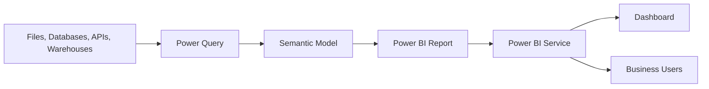
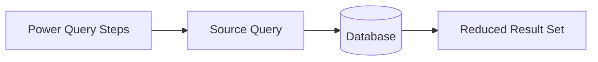
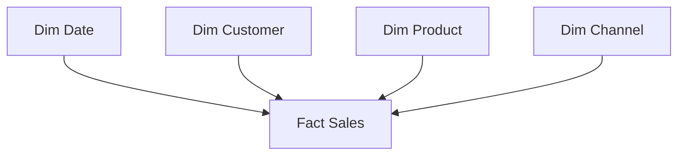
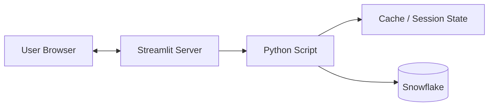
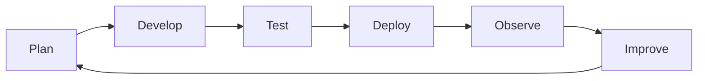
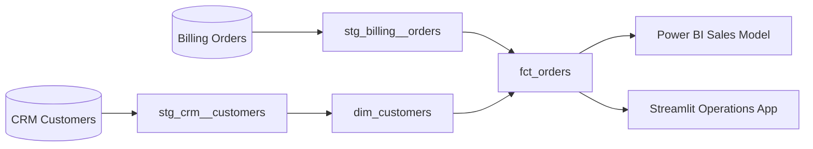
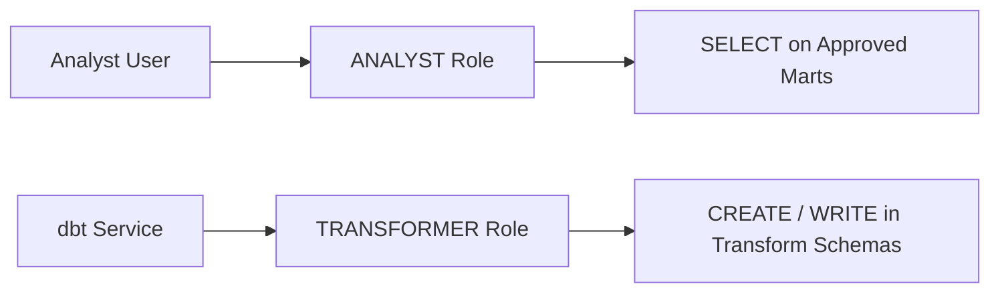
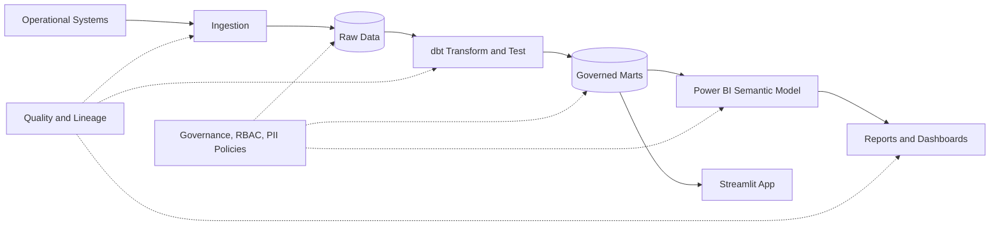

# Week 10 - Power BI / DAX / Streamlit / DataOps and Governance

## Learning Outcomes

By the end of this week you will be able to:

* Explain how Power BI Desktop, semantic models, reports, dashboards, and the Power BI service fit together.
* Connect Power BI to a data source and choose between Import and DirectQuery.
* Clean, transform, and combine data with Power Query.
* Design a star schema with fact tables, dimension tables, relationships, and a clear grain.
* Create DAX measures using aggregations, statistical functions, iterators, and `CALCULATE`.
* Use DAX Studio and Power BI Performance Analyzer to investigate model and query performance.
* Design reports with appropriate visuals, slicers, filters, conditional formatting, and anomaly analysis.
* Explain dashboard refresh and alert behavior.
* Build a basic Streamlit app and connect it safely to Snowflake.
* Describe the DataOps lifecycle and apply CI/CD and automated testing to dbt and Airflow projects.
* Evaluate data quality across accuracy, completeness, validity, consistency, uniqueness, and timeliness.
* Explain technical and business lineage, data governance, RBAC, PII handling, masking, and stewardship.
* Distinguish the purpose of GDPR, HIPAA, and SOC 2 without treating a tool feature as proof of compliance.

---

## Weekly Roadmap

| Day | Focus |
| --- | --- |
| **Monday** | Power BI introduction, data connections, importing, manipulation, transformation, and cleaning |
| **Tuesday** | Schema design, Power Query, DAX, DAX Studio, query execution, and performance monitoring |
| **Wednesday** | Report creation, custom visuals, slicing, filtering, conditional formatting, Analyze, and outliers |
| **Thursday** | Dashboards, data alerts, semantic-model refresh, DataOps, CI/CD, and automated testing |
| **Friday** | Streamlit architecture and Snowflake connectivity; data quality, lineage, governance, RBAC, PII, compliance, and stewardship |

---

# Part 1 - Power BI Foundations

## Power BI Introduction

**Power BI** is Microsoft's business intelligence platform for connecting to data, preparing it, modeling it, creating interactive reports, and sharing insights.



### Main Components

| Component | Purpose |
| --- | --- |
| **Power BI Desktop** | Windows authoring application for queries, modeling, DAX, and reports |
| **Power Query** | Connects, cleans, reshapes, and combines data using the M language |
| **Semantic model** | Tables, relationships, measures, hierarchies, and security rules used for analysis |
| **Report** | One or more interactive pages built from a semantic model |
| **Power BI service** | Cloud service for publishing, sharing, refreshing, dashboards, and governance |
| **Dashboard** | A service-only, single-page canvas of pinned tiles |
| **Gateway** | Secure bridge used when the service must reach certain private or on-premises sources |
| **Mobile apps** | Mobile consumption of reports and dashboards |

### Report vs Dashboard

| Feature | Report | Dashboard |
| --- | --- | --- |
| Pages | One or more | One canvas |
| Created in | Desktop or service | Power BI service |
| Data sources | Normally one semantic model per report | Tiles may come from multiple reports or semantic models |
| Interaction | Rich filtering, drill-through, bookmarks | High-level monitoring and tile navigation |
| Main purpose | Explore and analyze | Monitor important signals |

The terms are often used casually, but they are different Power BI artifacts.

---

## Connecting to a Data Source

In Power BI Desktop, use **Home > Get data**, select a connector, provide connection information, authenticate, and then choose **Load** or **Transform Data**.

Common sources include:

* Excel, CSV, JSON, XML, and folder collections.
* SQL Server, PostgreSQL, MySQL, Oracle, and Snowflake.
* SharePoint, Azure services, and web APIs.
* Existing Power BI semantic models.

### Connection Checklist

Before connecting, identify:

1. The source system and environment.
2. The database, warehouse, schema, or file path.
3. The authentication method.
4. The intended storage mode.
5. The required tables and columns.
6. Whether a gateway will be needed after publication.
7. The privacy classification of the data.

### Import vs DirectQuery

| Feature | Import | DirectQuery |
| --- | --- | --- |
| Data location | Copied into the Power BI semantic model | Remains in the source |
| Report query | Queries the in-memory model | Sends queries to the source |
| Typical speed | Usually fast for report interactions | Depends heavily on source and network performance |
| Freshness | Requires data refresh | Queries current source data during interactions |
| Data volume | Limited by capacity and model design | Can work with very large remote datasets |
| Modeling flexibility | Broad functionality | Some transformations and features have limitations |

Import is often the best default for interactive performance. DirectQuery is useful when data size, freshness, security, or architecture requires source-side queries.

Neither mode removes the need for a well-designed source and semantic model.

### Query Folding

**Query folding** occurs when Power Query translates transformation steps into a query that the source can execute.



Folding can reduce data movement and let the source use indexes, partitions, pruning, and distributed compute. Check folding rather than assuming every step folds.

---

## Importing Data

After selecting a source, the Navigator shows available objects. You can:

* **Load** selected data directly.
* **Transform Data** to open Power Query Editor first.

Prefer Transform Data when you need to:

* Remove unused rows or columns.
* Correct data types.
* Rename unclear fields.
* Merge or append datasets.
* Handle missing and invalid values.
* Create reusable parameters.

### Import Only What You Need

Avoid importing an entire operational database. Large, wide models:

* Consume more memory.
* Refresh more slowly.
* Confuse report authors.
* Increase the risk of exposing sensitive columns.

Select data based on the report's required grain, measures, slicing dimensions, and security rules.

---

## Power Query and Data Manipulation

Power Query records each transformation as an **Applied Step**. The steps are translated into the Power Query **M** language.

Typical transformations include:

* Filter rows.
* Select or remove columns.
* Rename columns.
* Replace values.
* Split or merge columns.
* Group rows.
* Pivot and unpivot columns.
* Merge queries with joins.
* Append queries vertically.
* Add conditional or custom columns.

### Merge vs Append

| Operation | Meaning | SQL Analogy |
| --- | --- | --- |
| **Merge** | Match rows from two queries using key columns | `JOIN` |
| **Append** | Stack rows from compatible queries | `UNION ALL` |

### Example M Query

```powerquery
let
    Source = Snowflake.Databases("account.snowflakecomputing.com", "BI_WH"),
    Analytics = Source{[Name="ANALYTICS"]}[Data],
    Sales = Analytics{[Name="MART", Kind="Schema"]}[Data]
        {[Name="FCT_SALES", Kind="Table"]}[Data],
    KeepColumns = Table.SelectColumns(
        Sales,
        {"ORDER_ID", "ORDER_DATE", "CUSTOMER_ID", "NET_AMOUNT"}
    ),
    CorrectTypes = Table.TransformColumnTypes(
        KeepColumns,
        {{"ORDER_DATE", type date}, {"NET_AMOUNT", Currency.Type}}
    ),
    ValidRows = Table.SelectRows(
        CorrectTypes,
        each [ORDER_ID] <> null and [NET_AMOUNT] >= 0
    )
in
    ValidRows
```

The graphical editor generates M for common operations. Reading M helps with debugging and review.

---

## Data Transformation

Transformation changes data into a form suitable for modeling and analysis.

### Good Transformation Goals

* One consistent data type per column.
* One documented grain per table.
* Stable keys for relationships.
* Human-readable column names.
* Reusable dimensions instead of duplicated attributes.
* Business logic located in an intentional layer.

### Where Should Logic Live?

| Layer | Good Use |
| --- | --- |
| Warehouse/dbt | Shared, governed transformations used by multiple consumers |
| Power Query | Report-specific shaping, source integration, and light cleanup |
| DAX measure | Interactive calculations that respond to filter context |
| Visual calculation | Calculation meaningful only within one visual |

Avoid implementing the same business metric independently in Snowflake SQL, Power Query, DAX, and Streamlit. Choose an authoritative definition.

---

## Data Cleaning

Cleaning improves usability and prevents misleading analysis.

### Common Problems

| Problem | Example | Treatment |
| --- | --- | --- |
| Missing values | Null customer ID | Investigate, reject, default, or retain intentionally |
| Duplicate rows | Repeated order ID | Define a business key and deterministic deduplication rule |
| Wrong type | Amount stored as text | Parse with error handling and inspect failures |
| Inconsistent values | `NY`, `New York`, `new york` | Standardize using a reference mapping |
| Invalid range | Negative quantity | Quarantine or correct according to business rules |
| Whitespace | ` premium ` | Trim and normalize |
| Mixed time zones | Local timestamps without offsets | Convert using known source semantics |

### Do Not Hide Bad Data

Replacing every error with null may make refresh succeed while concealing a source defect. Track:

* Number of rejected records.
* Reason for rejection.
* Source file or system.
* Detection time.
* Owner and resolution status.

---

# Part 2 - Semantic Modeling and DAX

## Designing Schemas

A strong Power BI semantic model normally resembles a **star schema**.



### Fact Tables

A fact table stores measurable events at a declared grain.

Example grain:

> One row per completed order line.

Typical fact columns:

* Foreign keys to dimensions.
* Degenerate identifiers such as order number.
* Additive numeric values such as quantity and net amount.
* Event timestamps or date keys.

### Dimension Tables

A dimension table describes business entities used to filter and group facts.

Examples:

* Date.
* Customer.
* Product.
* Geography.
* Sales channel.

### Relationships

The common relationship is:

```text
Dimension (one) ───────< Fact (many)
```

Prefer single-direction filtering from dimensions to facts unless a clear requirement justifies another design.

### Why Star Schemas Work Well

* Clear filter propagation.
* Reusable dimensions.
* Easier DAX.
* Better report author experience.
* Often better compression and performance.

### Date Table

A proper date table contains one row per date and useful attributes:

* Date.
* Year.
* Quarter.
* Month number and month name.
* Week.
* Fiscal periods where needed.

Sort month names by month number so visuals do not display months alphabetically.

---

## DAX: Data Analysis Expressions

**DAX** is the formula language used for measures, calculated columns, calculated tables, queries, and some visual calculations in Power BI.

### Measures vs Calculated Columns

| Feature | Measure | Calculated Column |
| --- | --- | --- |
| Evaluation | At query time | During data refresh |
| Main context | Filter context | Row context |
| Storage | Formula stored; result computed as needed | Values stored in the model |
| Responds to slicers | Yes | Stored value does not recalculate per interaction |
| Typical use | Aggregated business metrics | Row-level classification or relationship key |

Prefer measures for aggregations and interactive business metrics.

### Basic Measure Syntax

```dax
Total Sales =
SUM ( 'Fact Sales'[Net Amount] )
```

```dax
Order Count =
DISTINCTCOUNT ( 'Fact Sales'[Order ID] )
```

```dax
Average Order Value =
DIVIDE ( [Total Sales], [Order Count] )
```

`DIVIDE` safely handles a zero denominator and is generally clearer than manual division checks.

---

## DAX Aggregation

Common aggregation functions include:

| Function | Purpose |
| --- | --- |
| `SUM` | Sum one numeric column |
| `AVERAGE` | Arithmetic mean of a column |
| `MIN` / `MAX` | Smallest or largest value |
| `COUNT` | Count nonblank numeric values |
| `COUNTA` | Count nonblank values |
| `COUNTROWS` | Count rows in a table expression |
| `DISTINCTCOUNT` | Count unique nonblank values, with blank behavior considered |

### Iterator Functions

Functions ending in `X` evaluate an expression row by row and then aggregate.

```dax
Gross Sales =
SUMX (
    'Fact Sales',
    'Fact Sales'[Quantity] * 'Fact Sales'[Unit Price]
)
```

Use `SUM` when adding one column. Use `SUMX` when the aggregated value must be calculated for each row first.

---

## DAX Statistics

Useful statistical functions include:

```dax
Average Sale = AVERAGE ( 'Fact Sales'[Net Amount] )

Median Sale = MEDIAN ( 'Fact Sales'[Net Amount] )

Population Std Dev = STDEV.P ( 'Fact Sales'[Net Amount] )

Sample Std Dev = STDEV.S ( 'Fact Sales'[Net Amount] )

Minimum Sale = MIN ( 'Fact Sales'[Net Amount] )

Maximum Sale = MAX ( 'Fact Sales'[Net Amount] )
```

Choose population or sample standard deviation based on the question, not convenience.

### Percent of Total

```dax
Sales Percent of All Products =
DIVIDE (
    [Total Sales],
    CALCULATE (
        [Total Sales],
        REMOVEFILTERS ( 'Dim Product' )
    )
)
```

The numerator keeps the current product filter. The denominator removes product filters while retaining other relevant filters such as date.

---

## `CALCULATE`

`CALCULATE` evaluates an expression in a modified filter context. It is one of the most important DAX functions.

```dax
Online Sales =
CALCULATE (
    [Total Sales],
    'Dim Channel'[Channel Name] = "Online"
)
```

### Filter Context

Filter context comes from:

* Slicers.
* Visual rows and columns.
* Page, report, and visual filters.
* Cross-filtering from other visuals.
* Filters added or removed by DAX.

### Year-over-Year Example

```dax
Sales Previous Year =
CALCULATE (
    [Total Sales],
    SAMEPERIODLASTYEAR ( 'Dim Date'[Date] )
)

Sales YoY Change =
[Total Sales] - [Sales Previous Year]

Sales YoY Percent =
DIVIDE ( [Sales YoY Change], [Sales Previous Year] )
```

Time-intelligence calculations require a reliable date table and appropriate relationships.

### Common Filter Modifiers

| Function | Purpose |
| --- | --- |
| `REMOVEFILTERS` | Remove filters from specified tables or columns |
| `KEEPFILTERS` | Intersect a new filter with existing filters |
| `ALL` | Return all rows or values and commonly remove filters |
| `USERELATIONSHIP` | Activate an inactive relationship for one calculation |

---

## DAX Query Writing and Execution

A DAX query returns a table and commonly begins with `EVALUATE`.

```dax
EVALUATE
SUMMARIZECOLUMNS (
    'Dim Date'[Year],
    'Dim Product'[Category],
    "Sales", [Total Sales],
    "Orders", [Order Count]
)
ORDER BY
    'Dim Date'[Year],
    [Sales] DESC
```

Define a query-scoped measure:

```dax
DEFINE
    MEASURE 'Fact Sales'[Sales per Customer] =
        DIVIDE (
            [Total Sales],
            DISTINCTCOUNT ( 'Fact Sales'[Customer Key] )
        )

EVALUATE
SUMMARIZECOLUMNS (
    'Dim Customer'[Segment],
    "Sales per Customer", [Sales per Customer]
)
```

DAX query view helps inspect results, experiment with measures, and analyze queries generated by visuals.

---

## Introduction to DAX Studio

**DAX Studio** is a companion tool used to query and analyze tabular semantic models, including Power BI Desktop models.

Typical uses:

* Run DAX queries.
* Inspect server timings.
* View query plans.
* Analyze model metadata and storage.
* Investigate expensive measures.
* Export query results for controlled analysis.

### Setup Workflow

1. Install DAX Studio from its trusted distribution source.
2. Open the Power BI Desktop file.
3. Start DAX Studio.
4. Connect to the open Power BI model.
5. Write or paste a DAX query.
6. Enable diagnostic options when investigating performance.
7. Run the query and inspect results.

Do not make unsupported changes to a live Power BI model through external tools.

---

## Performance Monitoring Fundamentals

### Performance Analyzer

Power BI's **Performance Analyzer** records the time each visual takes to load and separates portions such as DAX query execution and visual rendering.

Basic workflow:

1. Open the **Optimize** ribbon.
2. Open **Performance Analyzer**.
3. Select **Start recording**.
4. Refresh visuals or reproduce a slow interaction.
5. Expand the slow visual.
6. Copy or run its DAX query for deeper analysis.

### DAX Studio Diagnostics

Use **Server Timings** and **Query Plan** to investigate whether work occurs in:

* The storage engine.
* The formula engine.
* Large scans.
* Repeated callbacks.
* Inefficient filters or iterators.

### Common Performance Improvements

* Use a star schema.
* Remove unused high-cardinality columns.
* Prefer numeric relationship keys.
* Reduce unnecessary calculated columns.
* Avoid bidirectional relationships without a specific need.
* Simplify visuals with excessive data points.
* Push reusable transformations upstream.
* Use variables in complex DAX for clarity and to avoid repeated expressions.
* Measure performance before and after each change.

```dax
Sales YoY Percent =
VAR CurrentSales = [Total Sales]
VAR PreviousSales = [Sales Previous Year]
RETURN
    DIVIDE ( CurrentSales - PreviousSales, PreviousSales )
```

---

# Part 3 - Reports, Dashboards, and Refresh

## Report Generation

A good report begins with user decisions, not chart types.

Ask:

* Who is the audience?
* What decisions should the report support?
* Which metrics are authoritative?
* What is the expected data freshness?
* Which dimensions should users explore?
* Which definitions and caveats must be visible?

### Recommended Page Structure

1. Title and reporting period.
2. Important filters.
3. Headline metrics.
4. Trends and comparisons.
5. Driver analysis.
6. Detailed table where useful.
7. Definitions, freshness, and owner.

### Choosing Visuals

| Question | Useful Visual |
| --- | --- |
| Trend over time | Line chart |
| Compare categories | Bar chart |
| Progress toward target | KPI or bullet-style visual |
| Composition | Stacked bar; pie only for a few simple parts |
| Distribution | Histogram, box plot, or column distribution |
| Relationship between measures | Scatter plot |
| Exact detailed values | Table or matrix |
| Location | Map only when geography is relevant |

Avoid using a chart merely because it looks interesting.

---

## Creating Reports

Basic workflow:

1. Confirm the semantic model and relationships.
2. Create explicit measures.
3. Add visuals to the canvas.
4. Assign fields to axes, values, legends, and tooltips.
5. Add slicers and filters.
6. Format titles, labels, units, and accessibility properties.
7. Test cross-filtering and drill behavior.
8. Validate totals against a trusted source.
9. Review performance.
10. Publish to the intended workspace.

### Keep Business Logic Out of Visual Titles

Use measures for calculations and dynamic title measures only where they genuinely improve context. Do not duplicate an important formula separately inside many visuals.

---

## Custom Visuals

Custom visuals extend the built-in visual library.

Before adding one, evaluate:

* Is it certified or otherwise trusted?
* What data does it receive?
* Is it accessible?
* Does it export or print correctly?
* Is it supported over time?
* Can a native visual answer the same question?
* Does it add performance overhead?

Prefer native visuals when they meet the requirement. Every custom dependency adds governance and maintenance work.

---

## Slicing and Filtering

### Slicers

A slicer is an on-canvas control users interact with.

Common slicers:

* Date range.
* Region.
* Product category.
* Customer segment.

### Filter Scopes

| Scope | Applies To |
| --- | --- |
| Visual-level | One visual |
| Page-level | All visuals on one page |
| Report-level | All report pages |
| Drill-through | Opens a detail page filtered to selected context |

### Interaction Design

Use **Edit interactions** to decide whether one visual filters, highlights, or does not affect another visual.

Too many synchronized slicers can confuse users and create expensive queries. Include only filters that support real decisions.

---

## Conditional Formatting

Conditional formatting uses color, icons, bars, or font styles to reveal important values.

Good uses:

* Highlight values below target.
* Show positive and negative variance.
* Add data bars to a compact table.
* Mark stale or missing records.

Poor uses:

* Decorative color without meaning.
* Red/green alone without icons or labels.
* A scale whose midpoint or range changes unpredictably.
* Coloring every cell so nothing stands out.

Define thresholds from business meaning and make them accessible.

---

## Analyze Features and Detecting Outliers

Power BI provides analysis features that can help explain changes, distributions, and unusual values depending on the visual and configuration.

### Outlier Workflow

1. Confirm the value is not a duplicate, unit error, or missing-data artifact.
2. Compare it with a relevant peer group.
3. Check seasonality and known events.
4. Examine sample size and denominator changes.
5. Drill to contributing records.
6. Document whether it is an error, expected exception, or actionable signal.

### Simple Z-Score Concept

```text
z = (value - mean) / standard deviation
```

A large absolute z-score can flag an unusual value, but it does not prove fraud, error, or business significance. Distribution shape and context matter.

### Correlation Is Not Causation

Two metrics moving together does not establish that one caused the other. Use the report to form questions, then validate explanations with controlled evidence.

---

## Dashboards

A dashboard is a single-page monitoring surface in the Power BI service.

Good dashboard design:

* Shows a small number of important signals.
* Uses consistent units and time periods.
* Links tiles to reports for deeper analysis.
* Displays freshness information.
* Has a clear owner and response process.

A dashboard should make it obvious what is healthy, what needs attention, and where to investigate.

---

## Data Alerts

Alerts notify a user when a supported dashboard tile crosses a configured threshold.

Example:

```text
Alert when failed pipeline count is greater than 0.
```

An alert is only useful if it has:

* A meaningful threshold.
* A clear recipient.
* A defined action.
* Deduplication or frequency controls.
* Reliable data refresh.

Avoid alert fatigue. If every change triggers a notification, important events will be ignored.

---

## Dataset and Semantic-Model Refresh

Current Power BI terminology generally uses **semantic model**, though older interfaces and materials may say **dataset**.

### Refresh Types

| Refresh | Meaning |
| --- | --- |
| Data refresh | Reloads imported source data and recalculates model objects |
| Schema refresh | Updates model structure when source columns or tables change |
| Visual refresh | Requeries the model or source and redraws visuals |
| Automatic page refresh | Requeries supported DirectQuery pages at a configured cadence |

### Scheduled Refresh Checklist

* Credentials are valid.
* Gateway is online where required.
* Source permissions are correct.
* Privacy levels are appropriate.
* Refresh duration fits capacity and scheduling limits.
* Schema changes are coordinated.
* Refresh history and warnings are monitored.
* Owners receive actionable failure notifications.

### Incremental Refresh

For large fact tables, incremental refresh can process recent partitions instead of reloading all history. It requires a suitable date/time column and an intentional policy.

Refreshing successfully does not prove the data is correct. Pair operational refresh monitoring with data-quality checks.

---

# Part 4 - Streamlit and Snowflake

## Introduction to Streamlit

**Streamlit** is a Python framework for building interactive data applications from scripts.



### Execution Model

Streamlit normally reruns the script from top to bottom when:

* A user changes a widget.
* The source code changes during development.
* The app is explicitly rerun.

This model is simple, but expensive operations must be cached or structured carefully.

### State and Caching

| Feature | Use |
| --- | --- |
| `st.session_state` | Per-session values that persist across reruns |
| `@st.cache_data` | Data results such as DataFrames or API responses |
| `@st.cache_resource` | Shared resources such as database connections or models |

Do not cache sensitive user-specific results globally without understanding who can receive the cached value.

---

## Setting Up Streamlit in a Virtual Environment

Create and activate an isolated environment:

```powershell
python -m venv .venv
.\.venv\Scripts\Activate.ps1
python -m pip install --upgrade pip
python -m pip install "streamlit[snowflake]" pandas
```

Save dependencies:

```powershell
python -m pip freeze > requirements.txt
```

Minimal app:

```python
import streamlit as st

st.set_page_config(page_title="StreamFlow Dashboard", layout="wide")
st.title("StreamFlow Dashboard")
st.write("The application is running.")
```

Run it:

```powershell
streamlit run app.py
```

Keep `.venv`, secrets, and local configuration out of Git.

---

## Core Streamlit Components

### Text and Layout

```python
st.title("Sales Operations")
st.header("Daily Performance")
st.markdown("Updated from the governed analytics mart.")

left, right = st.columns(2)
with left:
    st.metric("Revenue", "$125,400", "+4.2%")
with right:
    st.metric("Orders", "3,241", "-1.1%")
```

### DataFrames

```python
st.dataframe(
    daily_sales,
    use_container_width=True,
    hide_index=True,
)
```

### Sidebar Filters

```python
with st.sidebar:
    region = st.selectbox("Region", ["All", "East", "West"])
    start_date = st.date_input("Start date")
    show_detail = st.checkbox("Show detail rows")
```

### Charts

```python
st.line_chart(daily_sales, x="sale_date", y="revenue")
st.bar_chart(category_sales, x="category", y="revenue")
```

### Feedback and Status

```python
with st.spinner("Loading data..."):
    data = load_data()

if data.empty:
    st.warning("No rows match the current filters.")
else:
    st.success(f"Loaded {len(data):,} rows.")
```

---

## Connecting Streamlit to Snowflake

Use a dedicated least-privilege service identity or supported identity flow. Never hard-code credentials in `app.py`.

### Secrets File for Local Development

```toml
# .streamlit/secrets.toml - do not commit this file
[connections.snowflake]
account = "your_account"
user = "streamlit_service_user"
private_key_file = "../secrets/streamlit_service_user.p8"
role = "STREAMLIT_READER"
warehouse = "APP_WH"
database = "ANALYTICS"
schema = "MART"
```

### Connection Example

```python
import streamlit as st

conn = st.connection("snowflake")

def load_daily_sales(start_date, end_date):
    return conn.query(
        """
        select
            sale_date,
            region,
            revenue,
            order_count
        from analytics.mart.fct_daily_sales
        where sale_date between ? and ?
        order by sale_date, region
        """,
        params=(start_date, end_date),
        ttl=300,
    )
```

Exact connection parameters depend on the deployed Streamlit and Snowflake integration. Follow the current platform documentation for the selected environment.

### Security Rules

* Use parameterized queries.
* Grant only required schemas, views, and warehouses.
* Prefer governed views over raw tables.
* Set query timeouts and bound user-selected ranges.
* Do not display raw PII unless explicitly authorized.
* Log operational failures without logging secrets or sensitive result data.
* Rotate credentials and keys.

---

# Part 5 - DataOps, Testing, and Data Quality

## DataOps Lifecycle

**DataOps** applies collaborative, automated, observable, and iterative engineering practices to data delivery.



### Key Practices

* Version control for code and configuration.
* Small reviewable changes.
* Automated validation.
* Reproducible environments.
* Promotion through development, test, and production.
* Data and pipeline observability.
* Clear ownership and incident response.
* Documentation and lineage.
* Continuous feedback from consumers.

DataOps is not one product. It is an operating model supported by tools.

---

## CI/CD for dbt and Airflow

### Continuous Integration

CI validates a proposed change before merge.


### dbt CI Checks

Useful checks may include:

```bash
dbt deps
dbt parse
dbt compile
dbt build --select state:modified+
```

The exact selector depends on available state artifacts and the team's impact-analysis policy.

Use an isolated schema for CI so a pull request cannot overwrite another developer's objects.

### Airflow CI Checks

Useful checks may include:

* Python formatting and linting.
* Importing every DAG without errors.
* Checking for duplicate DAG and task IDs.
* Unit-testing Python callables.
* Validating dependency graphs and task parameters.
* Testing custom operators and hooks with mocks.
* Running integration tests in a representative environment.

Avoid making network calls or database queries while Airflow parses a DAG file.

### Continuous Delivery and Deployment

After merge:

1. Build an immutable artifact where possible.
2. Deploy to a test or staging environment.
3. Run smoke and integration tests.
4. Require approval for high-risk production changes.
5. Deploy with auditable automation.
6. Monitor health, data quality, and freshness.
7. Roll back or roll forward using a practiced process.

Database changes and data backfills may not be fully reversible. Plan compatibility and recovery explicitly.

---

## Automated Testing in Data Workflows

A layered test strategy catches different failures.

| Test Layer | Example |
| --- | --- |
| Static | SQL lint, YAML validation, Python lint |
| Unit | A transformation returns the expected output for small inputs |
| Schema/contract | Required columns and types exist |
| Data quality | IDs are unique and accepted values are valid |
| Integration | Pipeline reads and writes through connected components |
| End-to-end | Representative source data reaches the consumer correctly |
| Reconciliation | Counts and totals agree across boundaries |
| Smoke | Deployment loads and a critical query succeeds |

Tests should be deterministic, isolated, fast enough for their stage, and owned by someone who responds to failures.

---

## Dimensions of Data Quality

| Dimension | Question | Example Check |
| --- | --- | --- |
| **Accuracy** | Does the value represent reality? | Order total agrees with the source invoice |
| **Completeness** | Is required data present? | 99.9% of events have a user or anonymous ID |
| **Validity** | Does data satisfy its format and domain? | Status belongs to an approved list |
| **Consistency** | Do systems and fields agree? | Currency code and monetary unit align |
| **Uniqueness** | Are entities duplicated unexpectedly? | One current row per customer ID |
| **Timeliness** | Is data available when needed? | Latest load completed within 30 minutes |

Other useful dimensions include integrity, conformity, accessibility, and reliability.

### Define a Measurable Rule

Weak rule:

> Data should be fresh.

Measurable rule:

> During business hours, the maximum `ingested_at` in `raw.events` must be no more than 15 minutes behind the current time.

A useful rule states the dataset, field, calculation, threshold, evaluation schedule, severity, and owner.

---

## Testing Tools: dbt Tests

### Generic Data Tests

```yaml
version: 2

models:
  - name: fct_orders
    columns:
      - name: order_id
        data_tests:
          - not_null
          - unique

      - name: order_status
        data_tests:
          - accepted_values:
              arguments:
                values: [placed, paid, shipped, cancelled]

      - name: customer_id
        data_tests:
          - relationships:
              arguments:
                to: ref('dim_customers')
                field: customer_id
```

Some dbt versions and projects use the older `tests:` YAML key. Follow the syntax supported by the project's installed dbt version.

### Singular Data Test

```sql
-- tests/assert_paid_orders_have_positive_amount.sql

select *
from {{ ref('fct_orders') }}
where order_status = 'paid'
  and net_amount <= 0
```

The test passes when the query returns zero failing rows.

### Severity

Not every failure must block deployment. Teams may classify rules as:

* Warning.
* Error.
* Critical incident.

Severity should follow consumer impact and regulatory risk, not personal preference.

---

## Writing Test Cases for Raw and Transformed Data

### Raw Data Tests

Raw tests monitor the ingestion contract:

* Source freshness.
* Expected files or partitions arrived.
* Required fields exist.
* Parsing error rate is within tolerance.
* Volume is within an expected range.
* Duplicate event IDs are controlled.

Avoid rejecting valuable raw data solely because downstream business rules changed. Quarantine bad records and preserve evidence when possible.

### Transformed Data Tests

Transformed tests protect modeled meaning:

* Primary grain is unique.
* Foreign keys resolve.
* Measures are within valid ranges.
* Business states are mutually consistent.
* Slowly changing dimensions have non-overlapping validity windows.
* Aggregates reconcile to approved sources.

### Reconciliation Example

```sql
with raw as (
    select sum(amount) as amount
    from {{ source('payments', 'transactions') }}
    where transaction_date = current_date - 1
      and status = 'settled'
),

modeled as (
    select sum(payment_amount) as amount
    from {{ ref('fct_payments') }}
    where payment_date = current_date - 1
)

select
    raw.amount as raw_amount,
    modeled.amount as modeled_amount
from raw
cross join modeled
where abs(raw.amount - modeled.amount) > 0.01
```

Document accepted differences such as late arrivals, currency conversion, reversals, or excluded test accounts.

---

## Data Lineage

Lineage explains where data came from, how it changed, and what depends on it.



### Technical Lineage

Technical lineage describes physical and executable dependencies:

* Tables and columns.
* Jobs and tasks.
* SQL transformations.
* Files and APIs.
* Reports and applications.

### Business Lineage

Business lineage connects technical assets to meaning:

* Business terms.
* Metric definitions.
* Owners and stewards.
* Policies and classifications.
* Consumer use cases.

### Why Lineage Matters

* Impact analysis before a schema change.
* Faster incident investigation.
* Audit and compliance evidence.
* Identification of sensitive-data propagation.
* Consumer trust and discoverability.

Automatically inferred lineage is useful but incomplete. Dynamic SQL, external scripts, manually exported files, and undocumented business logic can create gaps.

---

# Part 6 - Governance, Security, and Compliance

## Data Governance Pillars

**Data governance** is the decision-making system for managing data as an organizational asset.

### Core Pillars

| Pillar | Key Question |
| --- | --- |
| Ownership | Who is accountable for the domain and decisions? |
| Quality | What makes the data fit for use, and who resolves failures? |
| Security | Who may access which data and under what conditions? |
| Privacy | How is personal data collected, used, retained, and deleted? |
| Cataloging | Can people discover and understand approved assets? |
| Lineage | Where did the data come from and where does it flow? |
| Lifecycle | How long is data retained, archived, and destroyed? |
| Standards | Which naming, modeling, documentation, and interoperability rules apply? |

Governance should enable safe use, not merely add approval gates.

---

## Role-Based Access Control in Data Warehouses

**RBAC** assigns privileges to roles and roles to users or service identities.



### Snowflake-Style Example

```sql
CREATE ROLE IF NOT EXISTS ANALYTICS_READER;

GRANT USAGE ON WAREHOUSE BI_WH
TO ROLE ANALYTICS_READER;

GRANT USAGE ON DATABASE ANALYTICS
TO ROLE ANALYTICS_READER;

GRANT USAGE ON SCHEMA ANALYTICS.MART
TO ROLE ANALYTICS_READER;

GRANT SELECT ON ALL VIEWS IN SCHEMA ANALYTICS.MART
TO ROLE ANALYTICS_READER;

GRANT SELECT ON FUTURE VIEWS IN SCHEMA ANALYTICS.MART
TO ROLE ANALYTICS_READER;
```

### Least Privilege

Grant only what an identity needs:

* People use named identities.
* Applications use dedicated service identities.
* Administrative roles are separate from daily roles.
* Read and write duties are separated where appropriate.
* Access is reviewed and revoked when no longer required.
* Emergency access is time-bound and audited.

Avoid granting privileges directly to many users when managed roles can express the policy more consistently.

---

## PII Handling and Masking

**Personally identifiable information (PII)** is information that identifies or can reasonably be linked to a person. Definitions vary by law and context.

Examples may include:

* Name.
* Email address.
* Phone number.
* Government identifier.
* Precise location.
* IP address or device identifier.
* Combinations of quasi-identifiers such as birth date and postal code.

### Protection Lifecycle


### Masking Example

```sql
CREATE OR REPLACE MASKING POLICY GOVERNANCE.POLICIES.EMAIL_MASK
AS (VALUE VARCHAR)
RETURNS VARCHAR ->
    CASE
        WHEN IS_ROLE_IN_SESSION('PII_READER') THEN VALUE
        ELSE REGEXP_REPLACE(VALUE, '.+@', '***@')
    END;
```

Apply the policy according to the warehouse's supported syntax and governance process.

### Protection Techniques

| Technique | Purpose |
| --- | --- |
| Dynamic masking | Return a protected representation based on query context |
| Tokenization | Replace a sensitive value with a reversible or mapped token |
| Hashing | Produce a one-way digest, with careful salt and attack considerations |
| Encryption | Protect data at rest or in transit using managed keys |
| Row access policy | Restrict which rows an identity can see |
| Aggregation | Expose summary data rather than individual records |
| Minimization | Do not collect or retain data that is not required |

Masking is not anonymization. Authorized users, joins, small groups, or auxiliary datasets may still make people identifiable.

---

## Compliance Standards and Frameworks

This section is educational, not legal advice. Applicability depends on the organization, data, jurisdiction, contracts, and role.

### GDPR

The **General Data Protection Regulation** governs processing of personal data in relevant European contexts.

Important themes include:

* Lawfulness, fairness, and transparency.
* Purpose limitation.
* Data minimization.
* Accuracy.
* Storage limitation.
* Integrity and confidentiality.
* Accountability.
* Data-subject rights.

### HIPAA

In the United States, **HIPAA** applies to covered entities and business associates handling protected health information under its scope.

Important themes include:

* Administrative, physical, and technical safeguards.
* Access controls.
* Audit controls.
* Integrity and transmission security.
* Appropriate agreements with service providers.

### SOC 2

**SOC 2** is an attestation framework based on Trust Services Criteria rather than a privacy law.

Criteria can cover:

* Security.
* Availability.
* Processing integrity.
* Confidentiality.
* Privacy.

### Controls vs Compliance

A masking policy, encryption setting, or SOC report can support a compliance program, but no single tool or certificate makes an entire organization compliant.

Compliance requires people, policies, risk assessment, documented controls, evidence, monitoring, and corrective action.

---

## Data Stewardship

A **data steward** helps translate governance policy into day-to-day data management.

### Typical Responsibilities

* Define and maintain business terms.
* Clarify data ownership.
* Approve quality rules and thresholds.
* Triage data issues.
* Review classifications and access needs.
* Coordinate retention and lifecycle requirements.
* Validate metadata and lineage.
* Communicate changes to producers and consumers.

### Roles Around a Data Asset

| Role | Primary Responsibility |
| --- | --- |
| Data owner | Accountable for the domain and risk decisions |
| Data steward | Maintains definitions, quality expectations, and governance operations |
| Data custodian | Operates the technical platform and safeguards |
| Data producer | Creates or supplies the data |
| Data consumer | Uses data for an approved purpose |

Exact titles vary. What matters is that accountability and response paths are explicit.

---

# Part 7 - End-to-End Mental Model



### Production Workflow

1. Source systems produce data under an agreed contract.
2. Ingestion lands raw data with source metadata.
3. dbt standardizes, transforms, documents, and tests data.
4. CI validates code and data changes before merge.
5. Airflow or another orchestrator schedules bounded workflows.
6. Governed marts expose approved grains and metrics.
7. Power BI provides semantic modeling and interactive reports.
8. Streamlit supports purpose-built analytical applications.
9. RBAC and privacy controls limit access.
10. Quality, lineage, refresh, and usage are monitored continuously.

---

## Common Mistakes and Gotchas

| Mistake | Why It Matters | Better Approach |
| --- | --- | --- |
| Importing every source column | Enlarges models and increases exposure | Select required columns intentionally |
| Using one flat table for everything | Duplicates attributes and complicates DAX | Design facts, dimensions, and grain |
| Using calculated columns for every metric | Increases model size and ignores interaction needs | Prefer measures for aggregations |
| Treating `CALCULATE` as simple arithmetic | Produces confusing results | Reason explicitly about filter context |
| Adding too many visuals | Slows pages and hides priorities | Keep visuals decision-focused |
| Trusting a chart without reconciling totals | Can publish polished wrong answers | Validate against authoritative queries |
| Treating visual refresh as data refresh | Can display stale imported data | Understand the refresh path |
| Hard-coding Streamlit secrets | Exposes credentials | Use secrets management and service identities |
| Querying Snowflake on every rerun | Adds latency and cost | Cache bounded results appropriately |
| Running full dbt builds for every tiny change | Slows feedback | Use safe state-aware selection and isolated schemas |
| Testing only nulls and uniqueness | Misses business failures | Add validity, reconciliation, and freshness rules |
| Treating lineage as automatically complete | Leaves blind spots | Combine automated lineage with ownership and review |
| Granting broad warehouse roles | Violates least privilege | Use functional roles and regular reviews |
| Assuming masking equals anonymization | Re-identification may remain possible | Apply minimization, policy, access, and aggregation controls |
| Calling a platform “compliant” | Compliance scope is organizational | Maintain controls, evidence, reviews, and legal guidance |

---

## Review Questions

1. What are the responsibilities of Power Query, a semantic model, a report, and a dashboard?
2. How does Import mode differ from DirectQuery?
3. What is query folding, and why does it matter?
4. What is the difference between Merge and Append in Power Query?
5. When should transformation logic live in dbt instead of Power Query?
6. What does the grain of a fact table describe?
7. Why is a star schema useful in Power BI?
8. What is the difference between a DAX measure and calculated column?
9. When should `SUMX` be used instead of `SUM`?
10. What does `CALCULATE` modify?
11. Why is a date table important for time intelligence?
12. What is the purpose of `EVALUATE` in a DAX query?
13. How do Performance Analyzer and DAX Studio complement each other?
14. Which visual best communicates a trend over time?
15. What is the difference between a slicer and a report-level filter?
16. What makes conditional formatting meaningful rather than decorative?
17. Why does an outlier require investigation before action?
18. How does a Power BI dashboard differ from a report page?
19. What must be in place for a useful data alert?
20. How does data refresh differ from visual refresh?
21. Why does Streamlit rerun a script after a widget changes?
22. When should `st.cache_data` and `st.cache_resource` be used?
23. How should a Streamlit app obtain Snowflake credentials?
24. What does DataOps add to a data engineering workflow?
25. Which checks belong in dbt and Airflow CI?
26. What are the main dimensions of data quality?
27. How do raw-data tests differ from transformed-model tests?
28. What is the difference between technical and business lineage?
29. What are the main pillars of data governance?
30. How does RBAC support least privilege?
31. Why is masking not the same as anonymization?
32. How do GDPR, HIPAA, and SOC 2 differ at a high level?
33. What does a data steward do?

---

## Quick Knowledge Check

### 1. A measure must change when a user selects a region slicer. Should it be a measure or calculated column?

Use a measure because it is evaluated in the current filter context.

### 2. A report page is slow, but only one visual accounts for most of the load time. What should you inspect first?

Use Performance Analyzer to separate its query and rendering time, then inspect the generated DAX with DAX query view or DAX Studio.

### 3. A Streamlit app reloads the same five-minute warehouse query after every harmless widget interaction. What should you consider?

Cache the bounded query result with an appropriate TTL, while ensuring the result is safe to share under the cache's scope.

### 4. A dbt pull request changes one staging model. What can make CI focused without skipping downstream impact?

Use state-aware selection that includes the modified model and affected descendants, supported by valid comparison artifacts.

### 5. A customer mart has no duplicate IDs but is three days stale. Is it high quality?

Not for a use case requiring current data. Uniqueness passes, but timeliness fails.

### 6. An analyst can query raw Social Security numbers because the role inherited a broad schema grant. What governance principle failed?

Least privilege failed. The role hierarchy and sensitive-data controls need review.

---

## Summary

| Topic | Key Takeaway |
| --- | --- |
| **Power BI** | Connects, models, visualizes, publishes, and monitors analytical data |
| **Power Query** | Cleans and reshapes data before it enters the semantic model |
| **Star schema** | Organizes facts and dimensions around a declared grain |
| **DAX measures** | Calculate interactive results in filter context |
| **`CALCULATE`** | Evaluates an expression under modified filter context |
| **DAX Studio** | Helps query and diagnose tabular semantic models |
| **Reports** | Support interactive analysis across one or more pages |
| **Dashboards** | Provide single-page monitoring in the Power BI service |
| **Refresh** | Keeps imported data and dependent artifacts current through a managed process |
| **Streamlit** | Builds interactive Python data applications with a rerun-based execution model |
| **DataOps** | Combines collaboration, automation, testing, deployment, and observability |
| **Data quality** | Must be measured across multiple dimensions and tied to use-case thresholds |
| **Lineage** | Connects source, transformation, meaning, and downstream impact |
| **Governance** | Assigns ownership and policies for safe, reliable data use |
| **RBAC** | Grants privileges through roles and supports least privilege |
| **PII protection** | Requires discovery, minimization, access control, masking, monitoring, and lifecycle controls |
| **Stewardship** | Turns governance policies into maintained definitions, quality, and accountability |

The Week 10 mental model is to deliver useful analytics without separating presentation from engineering discipline: model data clearly, calculate metrics deliberately, validate every layer, monitor freshness and performance, expose only appropriate data, and assign ownership for what happens when something goes wrong.

---

## Official Documentation

* [Power BI common query tasks](https://learn.microsoft.com/en-us/power-bi/transform-model/desktop-common-query-tasks)
* [Power BI star schema guidance](https://learn.microsoft.com/en-us/power-bi/guidance/star-schema)
* [Power BI calculation options](https://learn.microsoft.com/en-us/power-bi/transform-model/desktop-calculations-options)
* [Power BI Performance Analyzer](https://learn.microsoft.com/en-us/power-bi/create-reports/performance-analyzer)
* [Power BI data refresh](https://learn.microsoft.com/en-us/power-bi/connect-data/refresh-data)
* [Streamlit architecture and caching](https://docs.streamlit.io/develop/concepts/architecture/caching)
* [dbt Developer Hub](https://docs.getdbt.com/)
* [Snowflake access control](https://docs.snowflake.com/en/user-guide/security-access-control-overview)
* [Snowflake sensitive data classification](https://docs.snowflake.com/en/user-guide/classify-intro)
* [Snowflake dynamic data masking](https://docs.snowflake.com/en/user-guide/security-column-ddm-intro)
