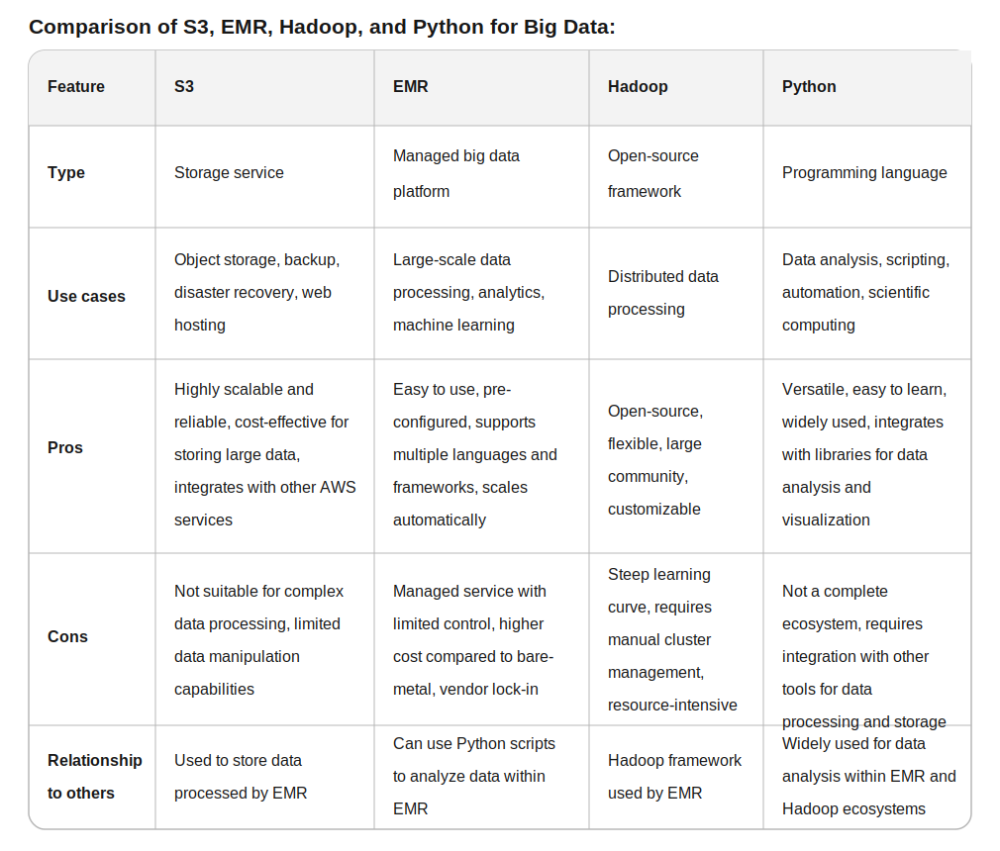
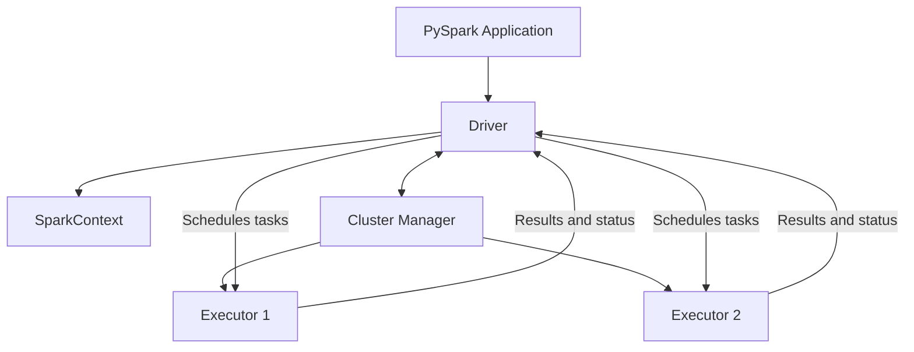

# Week 6 - Spark / RDDs / EMR

## Learning Outcomes

By the end of this week you will be able to:

* Explain where **Apache Spark** fits in the big data ecosystem.
* Compare **Hadoop MapReduce** and **Spark** at a high level.
* Describe Spark's major components: driver, executors, cluster manager, and SparkContext.
* Run PySpark locally and understand the difference between **local mode** and **cluster mode**.
* Create and transform **RDDs** using common transformations and actions.
* Use **shared variables**, including broadcast variables and accumulators.
* Load and save data through RDD APIs.
* Work with **key-value pair RDDs** for grouped, reduced, and joined data.
* Understand how Spark jobs run on **AWS EMR**.
* Submit Spark jobs using `spark-submit` and configure drivers, executors, and memory.

---

## Spark Ecosystem and Big Data Context

### Definition

**Apache Spark** is a distributed computing engine used to process large datasets across a cluster of machines.
It can handle batch processing, interactive analysis, machine learning, streaming, and graph workloads.

Spark is commonly used when one machine is not enough to process data efficiently.

### Spark Ecosystem

| Component | Purpose |
| --------- | ------- |
| **Spark Core** | Base engine for distributed processing, RDDs, scheduling, and memory management |
| **Spark SQL** | Structured data processing with SQL and DataFrames |
| **Spark Streaming / Structured Streaming** | Real-time or near-real-time data processing |
| **MLlib** | Machine learning algorithms and utilities |
| **GraphX** | Graph processing |
| **PySpark** | Python API for Spark |

### Why Spark Matters

* Processes data in parallel across multiple machines.
* Keeps intermediate data in memory when possible.
* Supports multiple APIs: Python, Scala, Java, R, and SQL.
* Integrates with storage systems like HDFS, S3, local files, Hive, and databases.
* Can run locally, on standalone clusters, YARN, Kubernetes, or AWS EMR.

### Big Data Tool Comparison



---

## Hadoop vs Spark

### Hadoop MapReduce

**Hadoop MapReduce** is an older distributed processing model built around two main phases:

* **Map:** process input records into intermediate key-value pairs.
* **Reduce:** aggregate or combine intermediate results.

MapReduce writes heavily to disk between stages, which makes it reliable but slower for iterative or interactive workloads.

### Spark

Spark generalizes distributed processing beyond MapReduce.
It builds a logical execution plan and can keep data in memory between steps.

| Feature | Hadoop MapReduce | Spark |
| ------- | ---------------- | ----- |
| Processing model | Map and Reduce phases | General DAG execution |
| Speed | Slower for iterative workloads | Faster due to memory reuse |
| APIs | Lower-level Java-heavy model | Python, Scala, Java, R, SQL |
| Intermediate data | Written to disk often | Stored in memory when possible |
| Workloads | Batch processing | Batch, SQL, streaming, ML, graph |

### Key Idea

Hadoop is often associated with storage and batch processing.
Spark is primarily a fast distributed compute engine.

They can work together: Spark can read data from HDFS or S3 and run on YARN or EMR.

---

## Spark Architecture

### Core Components

| Component | Description |
| --------- | ----------- |
| **Driver** | Main process that runs your Spark application and creates the execution plan |
| **SparkContext** | Entry point for low-level Spark functionality such as creating RDDs |
| **Cluster Manager** | Allocates resources across the cluster |
| **Executors** | Worker processes that run tasks and store data |
| **Tasks** | Small units of work sent to executors |



### Driver

The **driver** coordinates the Spark application.
It builds the job plan, talks to the cluster manager, schedules tasks, and collects results from executors.

### Executors

**Executors** run on worker nodes.
They execute tasks, store cached data, and return results to the driver.

### Cluster Manager

The **cluster manager** decides where resources come from.

Common cluster managers:

| Cluster Manager | Notes |
| --------------- | ----- |
| **Local** | Runs Spark on one machine for learning and development |
| **Standalone** | Spark's built-in cluster manager |
| **YARN** | Common in Hadoop ecosystems and EMR |
| **Kubernetes** | Runs Spark jobs in containers |

---

## SparkContext vs SparkSession

Before writing PySpark code, it helps to know the difference between Spark's two common entry points.

### SparkContext

**SparkContext** is the original entry point for Spark applications.
It connects your driver program to the Spark cluster and gives access to low-level Spark features.

You use SparkContext when working with:

* RDDs
* low-level distributed operations
* methods like `parallelize()`, `textFile()`, and `broadcast()`

In modern PySpark, you usually reach SparkContext through an existing SparkSession:

```python
sc = spark.sparkContext

rdd = sc.parallelize([1, 2, 3, 4, 5])
print(rdd.collect())
```

### SparkSession

**SparkSession** is the newer, higher-level entry point introduced in Spark 2.0.
It wraps SparkContext and adds support for structured APIs like DataFrames, SQL, Hive integration, and catalog operations.

In modern PySpark code, you usually create a SparkSession first:

```python
from pyspark.sql import SparkSession

spark = SparkSession.builder \
    .appName("Week6SparkExample") \
    .master("local[*]") \
    .getOrCreate()

sc = spark.sparkContext
```

### Quick Comparison

| Feature | SparkContext | SparkSession |
| ------- | ------------ | ------------ |
| Introduced | Original Spark API | Spark 2.0 |
| Main purpose | Low-level Spark connection and RDD work | Unified entry point for Spark apps |
| Common variable name | `sc` | `spark` |
| Best for | RDDs, accumulators, broadcast variables | DataFrames, SQL, modern PySpark workflows |
| Relationship | Created directly in older code | Contains a SparkContext |

### Rule of Thumb

Use **SparkSession** as your starting point in modern PySpark.
Then access **SparkContext** from it when you need RDD-level features.

```python
spark = SparkSession.builder.appName("Example").getOrCreate()
sc = spark.sparkContext
```

---

## Spark Setup and PySpark

### Definition

**PySpark** is the Python interface for Apache Spark.
It lets Python users write Spark applications without switching to Scala or Java.

### Basic PySpark Session

```python
from pyspark.sql import SparkSession

spark = SparkSession.builder \
    .appName("Week6SparkExample") \
    .master("local[*]") \
    .getOrCreate()

sc = spark.sparkContext

data = [1, 2, 3, 4, 5]
rdd = sc.parallelize(data)
print(rdd.collect())

spark.stop()
```

### Local vs Cluster Mode

| Mode | Description | Use Case |
| ---- | ----------- | -------- |
| **Local mode** | Runs Spark on your own machine | Learning, debugging, small tests |
| **Cluster mode** | Runs Spark across multiple machines | Production jobs and large datasets |

### Local Mode Examples

```bash
pyspark
```

```bash
spark-submit --master local[*] app.py
```

`local[*]` means Spark can use all available local CPU cores.

---

## RDD Fundamentals

### Definition

An **RDD** stands for **Resilient Distributed Dataset**.
It is Spark's original low-level distributed data abstraction.

An RDD is:

* **Resilient:** Spark can rebuild lost partitions using lineage.
* **Distributed:** Data is split across partitions on different workers.
* **Dataset:** A collection of records.

### When RDDs Are Useful

* Learning Spark's execution model.
* Working with unstructured or semi-structured data.
* Applying low-level transformations.
* Needing fine-grained control over distributed operations.

### Creating RDDs

```python
rdd = sc.parallelize([1, 2, 3, 4, 5])
```

```python
lines = sc.textFile("s3://bucket/path/file.txt")
```

### Partitions

Spark splits RDDs into **partitions**.
Each partition can be processed in parallel by a task.

More partitions can improve parallelism, but too many partitions add overhead.

```python
rdd = sc.parallelize(range(100), 4)
print(rdd.getNumPartitions())
```

---

## Transformations and Actions

### Core Idea

Spark operations fall into two categories:

* **Transformations** create a new RDD.
* **Actions** trigger execution and return results or write output.

Spark is **lazy**.
Transformations are not executed immediately.
They build a lineage plan that runs only when an action is called.

---

## Transformations

### Definition

A **transformation** returns a new RDD from an existing RDD.

Common transformations:

| Transformation | Purpose |
| -------------- | ------- |
| `map()` | Transform each element |
| `filter()` | Keep elements matching a condition |
| `flatMap()` | Transform each element into zero or more elements |
| `distinct()` | Remove duplicates |
| `union()` | Combine RDDs |
| `sample()` | Return a sample of records |
| `sortBy()` | Sort records |

### Examples

```python
nums = sc.parallelize([1, 2, 3, 4, 5])

squares = nums.map(lambda x: x * x)
evens = nums.filter(lambda x: x % 2 == 0)
```

```python
lines = sc.parallelize(["hello spark", "hello data"])
words = lines.flatMap(lambda line: line.split())
print(words.collect())
```

### Narrow vs Wide Transformations

| Type | Meaning | Examples |
| ---- | ------- | -------- |
| **Narrow** | Each output partition depends on one input partition | `map`, `filter` |
| **Wide** | Data must move across partitions | `groupByKey`, `reduceByKey`, `join` |

Wide transformations cause a **shuffle**, which is expensive because data moves across the network.

### RDD Set-Like Transformations

RDDs also support operations that feel similar to mathematical set operations.
These are useful when comparing two distributed collections.

| Operation | Meaning | Example Use |
| --------- | ------- | ----------- |
| `union()` | Combine records from both RDDs | Merge two input files |
| `intersection()` | Keep records found in both RDDs | Find common IDs |
| `subtract()` | Keep records from the first RDD that are not in the second | Remove known bad records |
| `distinct()` | Remove duplicate records | Get unique values |

```python
active_users = sc.parallelize([1, 2, 3, 4])
premium_users = sc.parallelize([3, 4, 5])

all_seen = active_users.union(premium_users)
both_groups = active_users.intersection(premium_users)
active_not_premium = active_users.subtract(premium_users)
unique_users = all_seen.distinct()
```

Important point: `union()` does not remove duplicates by itself.
If you need unique records, call `distinct()` after the union.

Set-like operations can be expensive on large data because Spark often needs to compare records across partitions, which may require a shuffle.

---

## Actions

### Definition

An **action** triggers Spark execution.
Actions either return data to the driver or write data to external storage.

Common actions:

| Action | Purpose |
| ------ | ------- |
| `collect()` | Return all records to the driver |
| `take(n)` | Return first `n` records |
| `count()` | Count records |
| `first()` | Return first record |
| `reduce()` | Combine records into one result |
| `foreach()` | Apply function to each record |
| `saveAsTextFile()` | Write output to storage |

### Examples

```python
nums = sc.parallelize([1, 2, 3, 4, 5])

print(nums.count())
print(nums.first())
print(nums.take(3))
print(nums.reduce(lambda a, b: a + b))
```

### Important Warning

Use `collect()` carefully.
It brings all data back to the driver.
For large datasets, this can crash the driver.

Prefer:

```python
rdd.take(10)
```

for quick inspection.

---

## Shared Variables

### Definition

Spark tasks run on different executors.
Normal Python variables are copied to tasks, but task-side changes do not automatically update the driver's copy.

Spark provides **shared variables** for special distributed use cases:

* **Broadcast variables**
* **Accumulators**

---

## Broadcast Variables

### Definition

A **broadcast variable** sends a read-only value to executors efficiently.
Instead of shipping the same large object with every task, Spark distributes it once per executor.

### Use Cases

* Lookup tables
* Small reference datasets
* Configuration dictionaries
* Mapping codes to names

### Example

```python
states = {
    "NY": "New York",
    "CA": "California",
    "TX": "Texas"
}

broadcast_states = sc.broadcast(states)

codes = sc.parallelize(["NY", "TX", "CA"])
names = codes.map(lambda code: broadcast_states.value[code])

print(names.collect())
```

---

## Accumulators

### Definition

An **accumulator** is a shared variable used for aggregating values from executors back to the driver.
Accumulators are commonly used for counters and metrics.

### Use Cases

* Count bad records.
* Track parsing errors.
* Count filtered rows.
* Gather simple job metrics.

### Example

```python
bad_records = sc.accumulator(0)

def parse_number(value):
    global bad_records
    try:
        return int(value)
    except ValueError:
        bad_records += 1
        return None

raw = sc.parallelize(["10", "20", "oops", "30", "bad"])
parsed = raw.map(parse_number).filter(lambda x: x is not None)

print(parsed.collect())
print("Bad records:", bad_records.value)
```

### Note

Accumulators are best for monitoring, not controlling business logic.
Task retries can make accumulator behavior tricky if used incorrectly.

---

## Data Loading and Saving with RDDs

### Loading Text Files

```python
lines = sc.textFile("data/input.txt")
```

Each line becomes one RDD element.

### Loading from S3

```python
lines = sc.textFile("s3://my-bucket/input/logs/")
```

On EMR, Spark can read from S3 directly when permissions are configured correctly.

### Saving Text Output

```python
result.saveAsTextFile("data/output")
```

Spark writes output as a folder containing part files:

```text
output/
  part-00000
  part-00001
  _SUCCESS
```

### Important Notes

* Output paths usually must not already exist.
* The number of output part files usually matches the number of partitions.
* Use `coalesce()` or `repartition()` to control output file count.

```python
result.coalesce(1).saveAsTextFile("data/single-output")
```

---

## Key-Value Pair RDDs

### Definition

A **key-value pair RDD** contains records shaped like:

```python
(key, value)
```

These RDDs unlock special operations for grouping, reducing, joining, and sorting by key.

### Creating Pair RDDs

```python
lines = sc.parallelize(["apple 2", "banana 3", "apple 4"])

pairs = lines.map(lambda line: line.split()) \
             .map(lambda parts: (parts[0], int(parts[1])))

print(pairs.collect())
```

### Common Pair RDD Operations

| Operation | Purpose |
| --------- | ------- |
| `reduceByKey()` | Combine values with the same key |
| `groupByKey()` | Group all values for each key |
| `mapValues()` | Transform values but keep keys |
| `sortByKey()` | Sort records by key |
| `join()` | Join two pair RDDs by key |
| `countByKey()` | Count records per key |

### Word Count Example

```python
lines = sc.parallelize([
    "spark is fast",
    "spark is distributed",
    "data is powerful"
])

counts = lines.flatMap(lambda line: line.split()) \
              .map(lambda word: (word, 1)) \
              .reduceByKey(lambda a, b: a + b)

print(counts.collect())
```

### reduceByKey vs groupByKey

| Operation | Behavior | Performance |
| --------- | -------- | ----------- |
| `reduceByKey()` | Combines values before and after shuffle | Usually better |
| `groupByKey()` | Shuffles all values, then groups | Can be expensive |

Prefer `reduceByKey()` when you are aggregating values.

### Join Example

```python
users = sc.parallelize([
    (1, "Ada"),
    (2, "Grace")
])

scores = sc.parallelize([
    (1, 95),
    (2, 98),
    (1, 88)
])

joined = users.join(scores)
print(joined.collect())
```

---

## Spark Job Execution Model

### Jobs, Stages, and Tasks

Spark breaks work into layers:

| Level | Meaning |
| ----- | ------- |
| **Application** | The full Spark program |
| **Job** | Triggered by an action |
| **Stage** | Group of tasks separated by shuffle boundaries |
| **Task** | Work on one partition |

### Execution Flow

1. Driver starts the Spark application.
2. Transformations build a logical lineage plan.
3. An action triggers a job.
4. Spark splits the job into stages.
5. Executors run tasks on partitions.
6. Results are returned to the driver or written to storage.

### Caching

Use caching when the same RDD is reused multiple times.

```python
clean = raw.filter(lambda line: "ERROR" not in line).cache()

print(clean.count())
print(clean.take(5))
```

Caching can improve performance, but it consumes executor memory.

---

## Spark Submit Overview

### Definition

`spark-submit` is the command-line tool used to launch Spark applications.

### Basic Local Example

```bash
spark-submit --master local[*] app.py
```

### Common Options

| Option | Purpose |
| ------ | ------- |
| `--master` | Defines where Spark runs |
| `--deploy-mode` | Determines where the driver runs |
| `--class` | Main class for Java/Scala apps |
| `--conf` | Sets Spark configuration values |
| `--driver-memory` | Memory for the driver |
| `--executor-memory` | Memory per executor |
| `--num-executors` | Number of executors |
| `--executor-cores` | CPU cores per executor |

### Example with Resources

```bash
spark-submit \
  --master yarn \
  --deploy-mode cluster \
  --driver-memory 2g \
  --executor-memory 4g \
  --num-executors 4 \
  --executor-cores 2 \
  s3://my-bucket/jobs/app.py
```

---

## AWS EMR and Spark Clusters

### Definition

**Amazon EMR** stands for **Elastic MapReduce**.
It is an AWS service for running big data frameworks such as Spark, Hadoop, Hive, and Presto.

EMR manages cluster provisioning so you can focus on running jobs.

### EMR Cluster Components

| Node Type | Purpose |
| --------- | ------- |
| **Primary node** | Manages the cluster and often runs coordination services |
| **Core nodes** | Run tasks and store data in HDFS |
| **Task nodes** | Run tasks but do not store HDFS data permanently |

### Creating an AWS Spark EMR Cluster

At a high level:

1. Choose EMR release version.
2. Select Spark as an application.
3. Choose instance types and node counts.
4. Configure networking, security groups, and IAM roles.
5. Choose logging location, usually S3.
6. Launch the cluster.
7. Submit Spark steps or connect and run jobs manually.

### EMR Storage Patterns

| Storage | Purpose |
| ------- | ------- |
| **S3** | Durable object storage, commonly used for input/output |
| **HDFS** | Distributed storage on cluster nodes |
| **Local disk** | Temporary executor storage and shuffle data |

S3 is usually preferred for durable data because the EMR cluster may be temporary.

---

## Running Spark Jobs on EMR

### Cluster Step Execution

An **EMR step** is a unit of work submitted to the cluster.
For Spark, a step often runs `spark-submit`.

Example step command:

```bash
spark-submit \
  --deploy-mode cluster \
  s3://my-bucket/jobs/word_count.py \
  s3://my-bucket/input/ \
  s3://my-bucket/output/
```

### Manual Execution on Cluster

You can also SSH into the primary node and run:

```bash
spark-submit app.py
```

In production, steps are usually easier to track, rerun, and automate.

### Launching a Spark Job

Typical job flow:

1. Upload code to S3.
2. Upload or identify input data.
3. Submit Spark job using an EMR step or `spark-submit`.
4. Monitor job progress in EMR, YARN, or Spark UI.
5. Review logs for failures.
6. Validate output in S3.
7. Terminate the cluster if it is no longer needed.

---

## Driver, Executors, and Memory Configuration

### Driver Configuration

The driver needs enough memory to:

* Build the execution plan.
* Track task metadata.
* Collect small result sets.
* Coordinate job execution.

Example:

```bash
--driver-memory 2g
```

Avoid collecting large datasets to the driver.

### Executor Configuration

Executors need enough memory and CPU to process partitions efficiently.

Common settings:

```bash
--executor-memory 4g
--executor-cores 2
--num-executors 6
```

### Memory and Performance Tips

* More executor memory helps with caching and large shuffles.
* More executor cores allow more parallel tasks per executor.
* Too many cores per executor can create garbage collection pressure.
* Too few partitions underuse the cluster.
* Too many partitions create scheduling overhead.

### Driver vs Executor

| Resource | Driver | Executor |
| -------- | ------ | -------- |
| Main role | Coordinates the application | Runs distributed tasks |
| Needs memory for | Metadata, planning, small results | Processing partitions, caching, shuffle |
| Common failure | `collect()` too much data | Out-of-memory during tasks or shuffle |

---

## Cluster Deploy Modes

### Client Mode

In **client mode**, the driver runs where `spark-submit` is executed.

Use cases:

* Interactive debugging
* Local development
* Notebooks

### Cluster Mode

In **cluster mode**, the driver runs inside the cluster.

Use cases:

* Production jobs
* EMR steps
* Long-running jobs where your local machine should not stay connected

| Deploy Mode | Driver Location | Best For |
| ----------- | --------------- | -------- |
| **Client** | Submit machine | Interactive work and debugging |
| **Cluster** | Cluster node/container | Production and scheduled jobs |

---

## End-to-End RDD Word Count

### Local Version

```python
from pyspark.sql import SparkSession

spark = SparkSession.builder \
    .appName("WordCountRDD") \
    .master("local[*]") \
    .getOrCreate()

sc = spark.sparkContext

input_path = "data/input.txt"
output_path = "data/output-word-count"

counts = sc.textFile(input_path) \
    .flatMap(lambda line: line.lower().split()) \
    .map(lambda word: (word, 1)) \
    .reduceByKey(lambda a, b: a + b) \
    .sortByKey()

counts.saveAsTextFile(output_path)

spark.stop()
```

### EMR-Oriented Version

```python
import sys
from pyspark.sql import SparkSession

spark = SparkSession.builder.appName("WordCountRDD").getOrCreate()
sc = spark.sparkContext

input_path = sys.argv[1]
output_path = sys.argv[2]

counts = sc.textFile(input_path) \
    .flatMap(lambda line: line.lower().split()) \
    .map(lambda word: (word, 1)) \
    .reduceByKey(lambda a, b: a + b)

counts.saveAsTextFile(output_path)

spark.stop()
```

Run on EMR:

```bash
spark-submit s3://my-bucket/jobs/word_count.py \
  s3://my-bucket/input/ \
  s3://my-bucket/output/word-count/
```

---

## Common Mistakes and Gotchas

| Mistake | Why It Matters | Better Approach |
| ------- | -------------- | --------------- |
| Using `collect()` on huge data | Can crash the driver | Use `take()`, `count()`, or write output |
| Using `groupByKey()` for sums | Shuffles too much data | Use `reduceByKey()` |
| Forgetting Spark is lazy | Transformations do not run immediately | Call an action to trigger execution |
| Writing to an existing output path | Spark often fails if path exists | Use a new output path |
| Too few partitions | Cluster sits idle | Repartition when needed |
| Too many partitions | Scheduling overhead increases | Coalesce when reducing output |
| Assuming local behavior equals cluster behavior | Paths, permissions, and resources differ | Test with S3/EMR-like settings |

---

## Discussion Points

* Why is Spark faster than Hadoop MapReduce for many iterative workloads?
* When should you use `reduceByKey()` instead of `groupByKey()`?
* What happens when an action is called on an RDD?
* Why can `collect()` be dangerous in distributed processing?
* How do driver memory and executor memory serve different purposes?
* Why is S3 commonly used as the durable storage layer for EMR jobs?

---

## Summary

| Topic | Key Takeaway |
| ----- | ------------ |
| **Spark** | Distributed engine for processing large datasets |
| **RDD** | Low-level distributed collection with lineage and partitions |
| **Transformations** | Build new RDDs lazily |
| **Actions** | Trigger execution and return or write results |
| **Shared variables** | Broadcast variables distribute read-only data; accumulators collect metrics |
| **Pair RDDs** | Enable key-based aggregation, grouping, sorting, and joins |
| **spark-submit** | Standard tool for launching Spark applications |
| **EMR** | AWS-managed cluster service for running Spark and other big data tools |
| **Driver and executors** | Driver coordinates; executors run tasks |
| **Cluster mode** | Preferred for production Spark jobs on EMR |

Spark's core idea is simple but powerful: split data into partitions, run work in parallel, and coordinate execution through a driver and executors. RDDs expose that model directly, making them a strong foundation for understanding Spark before moving into DataFrames, Spark SQL, and production-scale data pipelines.
