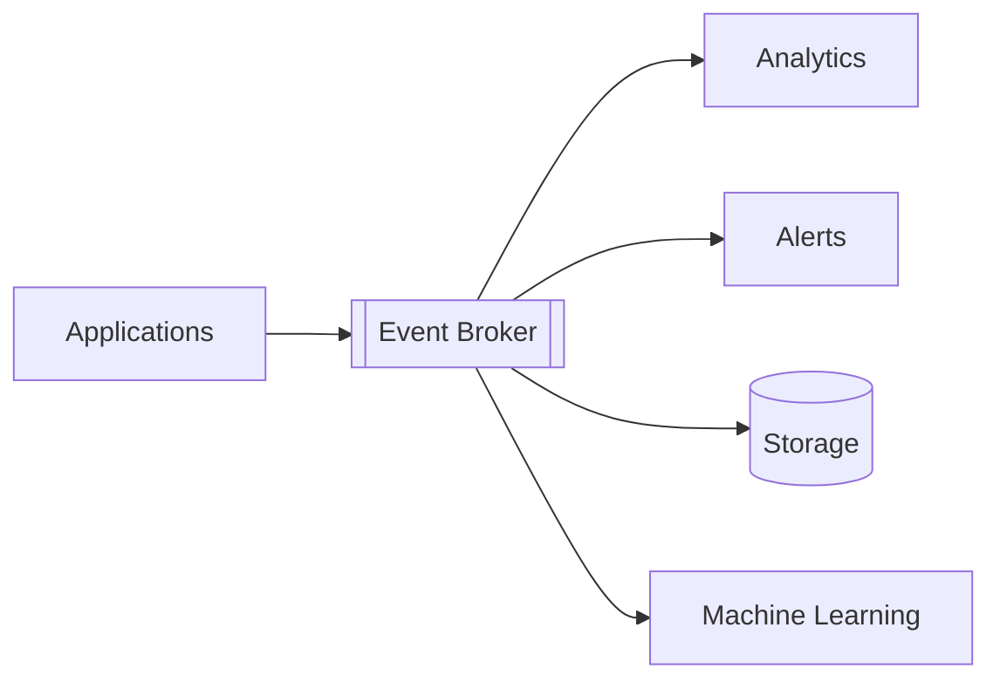
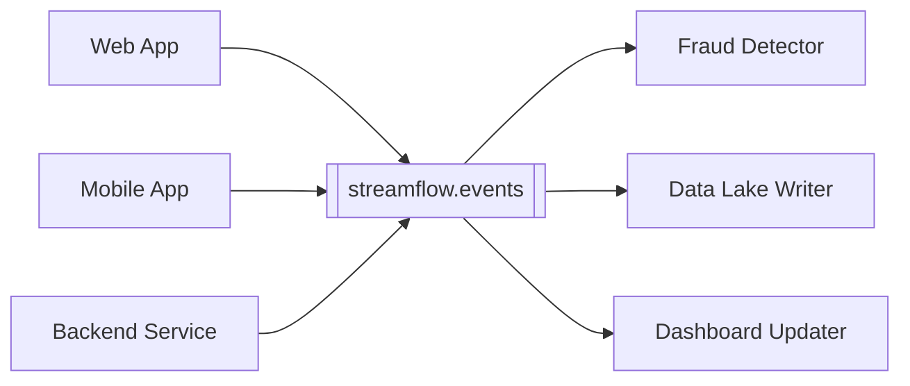
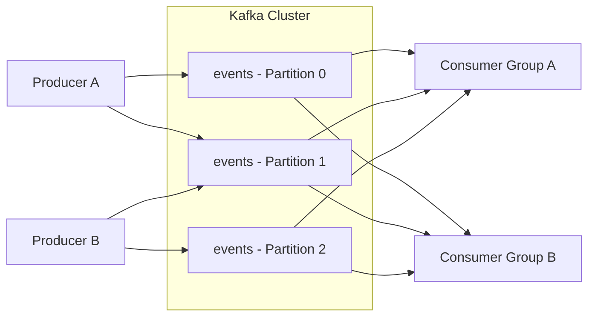
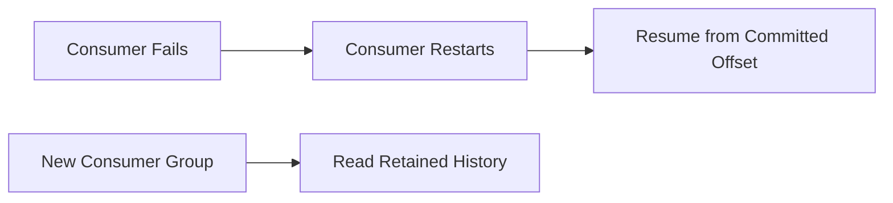
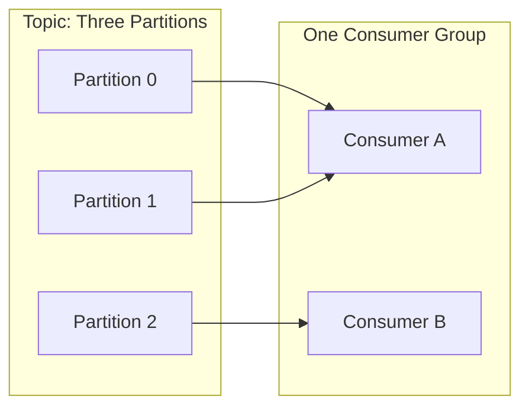
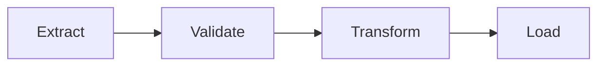
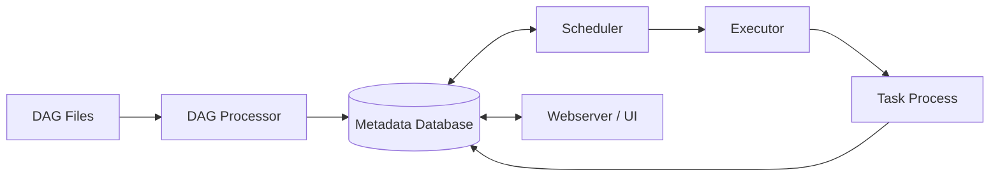
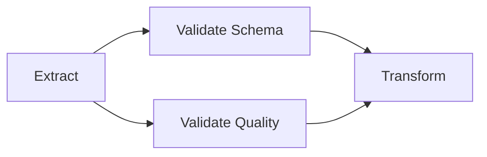
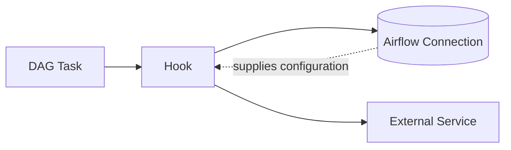

# Week 8 - Kafka / Streaming / Airflow

## Learning Outcomes

By the end of this week you will be able to:

* Explain the difference between batch processing and streaming.
* Describe Kafka's architecture, including brokers, topics, partitions, replicas, and offsets.
* Explain how producers, consumers, and consumer groups exchange events through Kafka.
* Create, list, and describe Kafka topics from the command line.
* Send and receive messages with Kafka console tools and Python.
* Configure the Kafka producer API for serialization, keys, acknowledgments, and retries.
* Explain Airflow's role as a workflow orchestrator.
* Identify the scheduler, webserver, metadata database, executor, workers, DAGs, tasks, and operators.
* Build an Airflow DAG with clear task dependencies.
* Create dynamic and parameterized DAGs without introducing unsafe side effects.
* Use Airflow connections and hooks to access external systems.

---

## Weekly Roadmap

| Day | Focus |
| --- | ----- |
| **Mon 7/13** | Streaming concepts, Kafka fundamentals and architecture, pub/sub messaging |
| **Tue 7/14** | Topic administration, producers, consumers, messages, and the producer API |
| **Wed 7/15** | Airflow concepts, components, local setup, and the UI |
| **Thu 7/16** | DAG design, operators, dependencies, dynamic DAGs, connections, and hooks |

---

# Part 1 - Streaming and Kafka

## Introduction to Streaming

### Definition

**Streaming** is the continuous movement and processing of data as events are created.
Instead of waiting for a complete dataset, a streaming system handles an ongoing sequence of records.

Examples of event streams include:

* Website clicks and page views.
* Purchases and payment events.
* Application logs.
* Sensor readings.
* Database change events.
* Location updates.

### Batch vs Streaming

| Feature | Batch Processing | Stream Processing |
| ------- | ---------------- | ----------------- |
| Input | Bounded, complete dataset | Unbounded sequence of events |
| Timing | Runs periodically | Runs continuously or in small intervals |
| Latency | Minutes to hours | Milliseconds to minutes |
| Example | Nightly sales report | Real-time fraud alert |
| Main challenge | Efficiently processing large volumes | Handling time, order, failures, and continuous state |

Streaming does not always mean that every record is processed instantly. Some systems use **micro-batches**, which group events into short intervals before processing them.

### Important Streaming Terms

| Term | Meaning |
| ---- | ------- |
| **Event** | A record describing something that happened |
| **Event time** | When the event occurred at its source |
| **Processing time** | When the processing system handled the event |
| **Throughput** | Number or volume of events processed per unit of time |
| **Latency** | Time between an event occurring and a result becoming available |
| **Backpressure** | A condition in which events arrive faster than downstream systems can process them |
| **Ordering** | The sequence in which events are stored or processed |
| **Delivery guarantee** | The system's promise about whether events may be lost or repeated |

### Why Use an Event Broker?

Directly connecting every producing application to every consuming application creates tight coupling.
An event broker sits between them:



Producers do not need to know which consumers exist. Consumers can work at different speeds and can be added without changing the producers.

---

## Introduction to Apache Kafka

### Definition

**Apache Kafka** is a distributed event-streaming platform. It stores ordered event records and lets many producers and consumers write and read those records independently.

Kafka is used for:

* Event-driven applications.
* Log and metric collection.
* Data integration between systems.
* Streaming analytics.
* Database change data capture.
* Feeding data lakes and warehouses.

### Kafka as a Distributed Log

Kafka is more than a message relay. Each topic partition behaves like an append-only log:

```text
offset       0         1         2         3
event     [login] [page_view] [purchase] [logout]
```

New records are appended. Existing records receive a stable numeric **offset**. Kafka retains records according to configuration, even after consumers read them.

This means a consumer can replay old records while they are still retained.

---

## Pub/Sub Messaging

### Publish and Subscribe

In the **publish/subscribe** model:

* A **publisher** produces a message to a named channel.
* A **subscriber** reads messages from that channel.
* Publishers and subscribers are decoupled.

Kafka uses **topics** as its named channels.



### Queue-like and Pub/Sub Behavior

Kafka consumer groups support both common messaging patterns:

* Consumers in the **same group** share the work. Each partition is assigned to only one consumer in that group at a time.
* Consumers in **different groups** each receive the topic independently.

For example, three instances of a fraud service might share one group, while a separate warehouse loader uses another group.

---

## Kafka Architecture

### Main Components

| Component | Purpose |
| --------- | ------- |
| **Broker** | Kafka server that stores partitions and handles client requests |
| **Cluster** | One or more Kafka brokers working together |
| **Topic** | Named stream or category of records |
| **Partition** | Ordered append-only portion of a topic |
| **Replica** | Copy of a partition stored on another broker |
| **Producer** | Client that writes records to a topic |
| **Consumer** | Client that reads records from a topic |
| **Consumer group** | Consumers that coordinate to share partitions |
| **Offset** | A record's numeric position inside one partition |
| **Controller** | Coordinates cluster metadata and partition leadership |

### High-Level Flow



### Brokers

A **broker** is one running Kafka server. It accepts producer writes, serves consumer reads, and stores topic partitions on disk.

A production cluster normally has multiple brokers so it can distribute load and survive broker failures. The Week 8 lab uses one broker for simplicity.

Clients use one or more **bootstrap servers** to make the initial connection. After connecting, the client retrieves cluster metadata and communicates with the appropriate brokers.

```text
localhost:9092
```

The bootstrap address is an entry point, not necessarily the only broker a client will use.

### Controllers: KRaft and ZooKeeper

Modern Kafka can manage cluster metadata using **KRaft**, Kafka's built-in consensus system. Older Kafka deployments used Apache ZooKeeper.

The lab's single Kafka process has both roles:

```yaml
KAFKA_CFG_PROCESS_ROLES: broker,controller
```

In production, broker and controller roles may be separated.

---

## Topics

### Definition

A **topic** is a named stream of related events. Topic names should clearly describe the data, such as:

```text
streamflow.events
orders.created
payments.failed
```

Topics are split into one or more partitions.

### Partitions

A **partition** provides:

* An ordered log of records.
* A unit of storage distribution.
* A unit of parallel work for consumers.

Kafka guarantees ordering **within a partition**, not across every partition in a topic.

If all events for one customer must remain ordered, a producer can use `customer_id` as the record key. Records with the same key are normally routed to the same partition.

### Keys and Partition Selection

At a high level:

* With a key, Kafka hashes the serialized key to choose a partition.
* Without a key, the producer distributes records according to its partitioning strategy.
* A producer may also explicitly select a partition, although this is less common.

Choosing a key affects both ordering and workload distribution. A key with only one common value can create a hot partition.

### Replication

Each partition can have copies on multiple brokers.

* The **leader replica** handles reads and writes.
* **Follower replicas** copy the leader's data.
* If the leader broker fails, an eligible follower can become leader.

A replication factor of `3` is common in production. A one-broker lab must use a replication factor of `1`.

### Retention

Kafka usually removes old records based on time or total log size. Consumption does not normally delete a record.

This differs from a traditional queue and makes replay possible:



---

## Producers

### Definition

A **producer** sends records to Kafka. A record can contain:

* Topic.
* Optional partition.
* Optional key.
* Value or message payload.
* Timestamp.
* Optional headers.

### Producer Send Flow

1. The application creates a record.
2. Serializers convert its key and value to bytes.
3. The partitioner selects a partition.
4. The producer batches records for efficiency.
5. The appropriate broker stores the record.
6. The broker returns an acknowledgment according to configuration.

### Acknowledgment Settings

| Setting | Meaning | Tradeoff |
| ------- | ------- | -------- |
| `acks=0` | Do not wait for a broker response | Lowest latency, greatest loss risk |
| `acks=1` | Wait for the partition leader | Balanced, but an unreplicated write can be lost |
| `acks=all` | Wait for all required in-sync replicas | Strongest durability, somewhat more latency |

Reliability also depends on replication and broker settings; `acks=all` alone cannot make a one-broker cluster fault tolerant.

### Serialization

Kafka stores bytes. A producer serializer converts application objects to bytes, and the consumer must use a compatible deserializer.

Common formats include:

* UTF-8 strings.
* JSON.
* Avro.
* Protocol Buffers.
* JSON Schema.

JSON is readable and convenient for learning, but production systems often add a schema registry and explicit schema evolution rules.

---

## Consumers

### Definition

A **consumer** subscribes to topics, receives records, and tracks its progress with offsets.

A consumed record includes metadata such as:

```text
topic=streamflow.events partition=1 offset=42
```

An offset only has meaning within its topic partition. Offset `42` in partition 0 is unrelated to offset `42` in partition 1.

### Consumer Groups

Consumers with the same `group.id` cooperate.



Important rules:

* One partition is assigned to at most one consumer in a group at a time.
* One consumer can own multiple partitions.
* Extra consumers beyond the partition count remain idle.
* Different groups read the same topic independently.

### Rebalancing

Kafka performs a **rebalance** when group membership or topic partitions change. It redistributes partition assignments among the active consumers.

Rebalances are useful, but frequent rebalances interrupt processing. Consumers should poll regularly and avoid work that exceeds configured time limits.

### Offset Commits

A consumer commits offsets to record its progress. After a restart, the group normally resumes near its last committed position.

| Strategy | Benefit | Risk |
| -------- | ------- | ---- |
| Automatic commits | Easy to configure | Offset may be committed before processing is safely complete |
| Manual commits | Application controls when progress is recorded | More code and careful error handling required |

### `auto_offset_reset`

This setting applies when the consumer group has no valid committed offset:

| Value | Behavior |
| ----- | -------- |
| `earliest` | Begin at the oldest retained record |
| `latest` | Begin with new records arriving after the consumer starts |

It does not force an existing group to replay data if that group already has committed offsets. To test from the beginning, use a new group ID or reset the group's offsets.

---

## Delivery Semantics

Distributed systems can fail between processing a record and saving progress.

| Guarantee | Meaning |
| --------- | ------- |
| **At most once** | Records may be lost but are not intentionally processed twice |
| **At least once** | Records are not intentionally lost but may be processed more than once |
| **Exactly once** | Each logical result is committed once under the supported transaction model |

At-least-once delivery is common. Consumers should therefore make processing **idempotent**, meaning repeating the same event does not create a second incorrect result.

An `event_id` can help detect duplicates.

---

## Kafka Command-Line Workflow

The repository's Kafka lab runs Kafka 3.7 in Docker using KRaft mode.

### Start Kafka

```bash
docker compose up -d
docker compose logs kafka
```

Wait for Kafka to finish starting before issuing administration commands.

### Create a Topic

```bash
docker compose exec kafka kafka-topics.sh \
  --bootstrap-server localhost:9092 \
  --create \
  --topic streamflow.events \
  --partitions 3 \
  --replication-factor 1
```

The important arguments are:

| Argument | Purpose |
| -------- | ------- |
| `--bootstrap-server` | Broker used to enter the cluster |
| `--create` | Requests topic creation |
| `--topic` | Topic name |
| `--partitions` | Number of ordered logs and maximum useful group parallelism |
| `--replication-factor` | Number of copies of each partition |

### Retrieve the List of Topics

```bash
docker compose exec kafka kafka-topics.sh \
  --bootstrap-server localhost:9092 \
  --list
```

### Describe a Topic

```bash
docker compose exec kafka kafka-topics.sh \
  --bootstrap-server localhost:9092 \
  --describe \
  --topic streamflow.events
```

The description shows partition IDs, leaders, replicas, and in-sync replicas.

### Create a Console Consumer

Start this first terminal:

```bash
docker compose exec kafka kafka-console-consumer.sh \
  --bootstrap-server localhost:9092 \
  --topic streamflow.events \
  --from-beginning
```

### Create a Console Producer

Start this in a second terminal:

```bash
docker compose exec -it kafka kafka-console-producer.sh \
  --bootstrap-server localhost:9092 \
  --topic streamflow.events
```

Enter one JSON object per line:

```json
{"event_id":"evt_001","event_type":"page_view","user_id":"user_101"}
{"event_id":"evt_002","event_type":"purchase","user_id":"user_102"}
```

The producer sends each submitted line as one record. Press `Ctrl+C` to stop either tool.

---

## Python Producer API

The repository lab uses the `kafka-python` package:

```bash
pip install kafka-python
```

### JSON Producer

```python
import json
from kafka import KafkaProducer

producer = KafkaProducer(
    bootstrap_servers="localhost:9092",
    key_serializer=lambda key: key.encode("utf-8"),
    value_serializer=lambda value: json.dumps(value).encode("utf-8"),
    acks="all",
    retries=3,
)

event = {
    "event_id": "evt_101",
    "event_type": "purchase",
    "user_id": "user_201",
    "amount": 49.99,
}

future = producer.send(
    "streamflow.events",
    key=event["user_id"],
    value=event,
)

metadata = future.get(timeout=10)
print(
    f"topic={metadata.topic} "
    f"partition={metadata.partition} "
    f"offset={metadata.offset}"
)

producer.flush()
producer.close()
```

### Key Producer Methods

| Method | Purpose |
| ------ | ------- |
| `send()` | Asynchronously enqueue a record for sending |
| `flush()` | Wait until buffered records have been sent |
| `close()` | Flush and release producer resources |
| `future.get()` | Wait for one send and surface its error or metadata |

`send()` is asynchronous. Printing `sent` immediately after it does not prove the broker accepted the record. Waiting on the returned future or calling `flush()` reveals send failures.

### Common Producer Configuration

| Option | Purpose |
| ------ | ------- |
| `bootstrap_servers` | Initial broker address or addresses |
| `key_serializer` | Converts keys to bytes |
| `value_serializer` | Converts values to bytes |
| `acks` | Required broker acknowledgment level |
| `retries` | Number of retry attempts for retryable failures |
| `batch_size` | Maximum record batch size |
| `linger_ms` | Brief wait that can allow fuller batches |
| `compression_type` | Compresses batches, such as gzip or snappy when supported |

Batching and compression can improve throughput at the cost of some CPU or latency.

---

## Python Consumer Example

```python
import json
from kafka import KafkaConsumer

consumer = KafkaConsumer(
    "streamflow.events",
    bootstrap_servers="localhost:9092",
    group_id="streamflow-review-consumer",
    auto_offset_reset="earliest",
    enable_auto_commit=True,
    key_deserializer=(
        lambda key: key.decode("utf-8") if key is not None else None
    ),
    value_deserializer=lambda value: json.loads(value.decode("utf-8")),
    consumer_timeout_ms=10000,
)

for message in consumer:
    print(
        f"key={message.key} "
        f"partition={message.partition} "
        f"offset={message.offset} "
        f"event={message.value}"
    )

consumer.close()
```

### Producer and Consumer Agreement

The two clients must agree on:

* Broker address reachable from their network.
* Topic name.
* Key and value encoding.
* Message schema and required fields.

Kafka does not automatically understand that a JSON field should be a timestamp or decimal. Schema validation belongs in the application or schema tooling.

---

## Kafka Common Issues

| Problem | Likely Cause | Fix |
| ------- | ------------ | --- |
| `NoBrokersAvailable` | Kafka is starting or advertised listener is unreachable | Check container logs and listener configuration |
| Topic already exists | Setup was previously completed | Continue, or intentionally recreate the environment |
| Consumer prints nothing | It started at latest or its group already committed offsets | Produce a new record or use a new group ID |
| Records appear out of order | They were written to different partitions | Key related records into the same partition |
| Only some consumers work | There are more consumers than partitions | Add partitions or reduce group size |
| JSON decode fails | Producer and consumer serializers disagree | Standardize the record encoding and schema |
| Duplicate output | At-least-once processing repeated a record | Make the consumer idempotent using an event ID |

---

# Part 2 - Apache Airflow

## Introduction to Airflow

### Definition

**Apache Airflow** is a platform for authoring, scheduling, and monitoring workflows. Workflows are defined in Python as directed acyclic graphs, or DAGs.

Airflow is an **orchestrator**. It coordinates work performed by Python programs, shell commands, Spark jobs, databases, cloud services, and other systems.

Airflow is not primarily:

* A streaming broker like Kafka.
* A distributed processing engine like Spark.
* A data warehouse.
* A replacement for application business logic.

### Kafka, Spark, and Airflow Together

| Tool | Main Job |
| ---- | -------- |
| **Kafka** | Transport and retain event streams |
| **Spark** | Transform and analyze data at scale |
| **Airflow** | Schedule, coordinate, retry, and monitor workflows |

For example, Kafka can collect live events, Spark can process a batch of retained events, and Airflow can schedule a daily aggregation and quality check.

Airflow is best for finite tasks with a start and an end. A permanently running Kafka consumer is usually managed as a service rather than as one never-ending Airflow task.

---

## Key Airflow Concepts

### DAG

A **DAG** describes a workflow and its dependency graph.

* **Directed:** dependencies have a direction.
* **Acyclic:** following dependencies can never loop back to an earlier task.
* **Graph:** tasks are nodes and dependencies are edges.



The DAG defines what should run and in what order. A **DAG run** is one execution of that definition.

### Task and Task Instance

* A **task** is one unit of work in the DAG definition.
* A **task instance** is that task for one specific DAG run.

The same task can succeed in today's run and fail in tomorrow's run; those are different task instances.

### Operator

An **operator** is a reusable task template. When placed in a DAG, an operator creates a task.

| Operator Style | Use |
| -------------- | --- |
| `PythonOperator` | Run a Python callable |
| `BashOperator` | Run a shell command |
| `EmptyOperator` | Create a no-work boundary or marker |
| Provider operators | Interact with systems such as AWS, databases, or Spark |
| `@task` | TaskFlow API for Python functions |

### Sensor

A **sensor** is a specialized operator that waits for a condition, such as a file appearing or an upstream workflow completing. Long-running sensors should use an appropriate reschedule or deferrable mode when available so they do not occupy a worker unnecessarily.

### XCom

**XCom** lets tasks exchange small pieces of metadata. A TaskFlow function's return value is automatically available to downstream TaskFlow tasks.

Use XCom for values such as a path, record count, or job ID. Do not use it to move an entire large dataset; store the data externally and pass its location.

---

## Airflow Architecture

| Component | Responsibility |
| --------- | -------------- |
| **Scheduler** | Creates scheduled DAG runs and queues ready task instances |
| **Executor** | Decides how and where queued task instances run |
| **Worker** | Executes tasks for distributed executor setups |
| **Webserver / UI** | Displays DAGs, runs, task status, logs, and administration screens |
| **Metadata database** | Stores Airflow state, schedules, task instances, and configuration metadata |
| **DAG processor** | Parses Python DAG files and serializes workflow definitions |
| **Triggerer** | Runs triggers for deferrable tasks |

### Simplified Control Flow



Airflow's metadata database stores orchestration state. Your business data should normally live in purpose-built storage rather than in the Airflow metadata database.

### Executors

The executor determines task execution strategy.

* A local or sequential setup is useful for development.
* Distributed executors can send work to multiple workers.
* Kubernetes-based execution can run tasks in separate pods.

The Week 8 lab uses `airflow standalone`, which combines the pieces needed for a convenient local learning environment.

---

## Setting Up Airflow Locally

The repository lab pins the image `apache/airflow:2.9.3`.

### Docker Compose Service

```yaml
services:
  airflow:
    image: apache/airflow:2.9.3
    container_name: streamflow_lab07_airflow
    ports:
      - "8080:8080"
    environment:
      AIRFLOW__CORE__LOAD_EXAMPLES: "false"
    volumes:
      - ./dags:/opt/airflow/dags
      - ./data:/opt/airflow/data
      - ./logs:/opt/airflow/logs
    command: standalone
```

Start the environment:

```bash
docker compose up -d
docker compose logs -f airflow
```

Retrieve the generated local password:

```bash
docker compose exec airflow \
  cat /opt/airflow/standalone_admin_password.txt
```

Open `http://localhost:8080` and sign in, usually with username `admin`.

### Useful CLI Commands

```bash
docker compose exec airflow airflow dags list
docker compose exec airflow airflow dags list-import-errors
docker compose exec airflow airflow dags trigger lab07_basic_pipeline
docker compose exec airflow airflow dags list-runs -d lab07_basic_pipeline
```

---

## Airflow UI Overview

The UI is the main place to monitor and troubleshoot workflows.

| View or Area | What It Shows |
| ------------ | ------------- |
| DAG list | Available DAGs, schedules, recent run state, and pause status |
| Grid view | Task states across multiple DAG runs |
| Graph view | Task dependency structure for a run |
| Task instance details | Attempts, duration, rendered fields, and metadata |
| Logs | Output and error information from a task attempt |
| Code | Parsed DAG source, subject to deployment settings |
| Connections | External system credentials and endpoints, when user permissions allow |

### Basic Troubleshooting Path

1. Confirm the DAG appears in the DAG list.
2. If missing, inspect DAG import errors.
3. Open the failed DAG run.
4. Select the failed task instance.
5. Read its logs from the earliest useful error.
6. Fix the underlying code, environment, connection, or data problem.
7. Clear or rerun only the appropriate failed work.

---

## DAG Design

### A Basic TaskFlow DAG

```python
from airflow.decorators import dag, task
from pendulum import datetime


@dag(
    dag_id="week8_event_summary",
    start_date=datetime(2026, 1, 1),
    schedule=None,
    catchup=False,
    tags=["week8", "events"],
)
def week8_event_summary():
    @task
    def extract():
        return ["page_view", "purchase", "page_view"]

    @task
    def transform(events):
        return {
            event_type: events.count(event_type)
            for event_type in set(events)
        }

    @task
    def load(summary):
        print(summary)

    load(transform(extract()))


week8_event_summary()
```

Calling the decorated functions while defining the DAG creates tasks and dependencies; it does not run the business logic immediately.

### Important DAG Arguments

| Argument | Purpose |
| -------- | ------- |
| `dag_id` | Unique, stable workflow identifier |
| `start_date` | Earliest logical date used for scheduling |
| `schedule` | Timetable, cron expression, preset, or `None` |
| `catchup` | Whether to create historical scheduled runs since the start date |
| `tags` | Labels used to organize DAGs in the UI |
| `default_args` | Shared task defaults such as retries |

### Scheduling Idea

Airflow creates runs for logical data intervals. A daily scheduled run generally represents a completed daily interval; it is not simply a timer that means "run now."

For learning and manual triggering, this is straightforward:

```python
schedule=None
catchup=False
```

### Design Principles

Good tasks should be:

* **Idempotent:** safe to retry for the same input interval.
* **Atomic:** responsible for one clear unit of work.
* **Observable:** log useful context and produce detectable results.
* **Independent:** exchange data through durable storage rather than local worker files when workers may differ.
* **Bounded:** finish or fail rather than run forever.

Avoid performing network calls, database queries, or heavy computation at the top level of a DAG file. Airflow parses DAG files repeatedly, so top-level side effects can slow or destabilize the scheduler.

---

## Operators

### TaskFlow `@task`

TaskFlow is convenient for Python-based tasks and automatically connects returned values through XCom.

```python
@task(retries=2)
def validate(record_count: int):
    if record_count == 0:
        raise ValueError("No records found")
```

### BashOperator

Use `BashOperator` when the main unit of work is a command-line program:

```python
from airflow.operators.bash import BashOperator

run_spark = BashOperator(
    task_id="run_spark_job",
    bash_command=(
        "spark-submit /opt/airflow/jobs/process_events.py "
        "--input /opt/airflow/data/events.jsonl "
        "--output /opt/airflow/output/event_summary"
    ),
)
```

### Choosing an Operator

Choose the operator that expresses the external work clearly. Airflow should launch and monitor a Spark job; the Spark transformation should remain in the Spark application rather than being rewritten as complex logic inside the DAG file.

---

## Task Dependencies

### Bitshift Operators

```python
extract >> validate >> transform >> load
```

`A >> B` means B is downstream of A and normally waits for A to succeed.

### Fan-Out and Fan-In

```python
extract >> [validate_schema, validate_quality]
[validate_schema, validate_quality] >> transform
```



### Method Form

```python
extract.set_downstream(validate)
load.set_upstream(transform)
```

The bitshift form is more common because it is compact and visually resembles the graph.

### Trigger Rules

By default, a downstream task generally runs only when all upstream tasks succeed. A **trigger rule** can change this for cleanup, notifications, or branching joins.

Use nondefault trigger rules deliberately. A cleanup task that must run after either success or failure has different semantics from a transformation that requires all valid inputs.

---

## Dynamic and Parameterized DAGs

These are related but different ideas.

### Parameterized DAG

One reusable DAG can accept values at trigger time:

```python
from airflow.decorators import dag, task
from airflow.models.param import Param
from pendulum import datetime


@dag(
    dag_id="parameterized_event_job",
    start_date=datetime(2026, 1, 1),
    schedule=None,
    catchup=False,
    params={
        "source": Param("web", type="string"),
        "minimum_count": Param(1, type="integer", minimum=1),
    },
)
def parameterized_event_job():
    @task
    def show_parameters(**context):
        params = context["params"]
        print(params["source"], params["minimum_count"])

    show_parameters()


parameterized_event_job()
```

Parameters should be validated and should not be directly inserted into unsafe shell or SQL strings.

### Dynamic DAG Generation

Python can generate several similar tasks or DAGs from configuration:

```python
SOURCES = ["mobile", "partner", "web"]

for source in sorted(SOURCES):
    BashOperator(
        task_id=f"process_{source}",
        bash_command=f"python process_source.py --source {source}",
    )
```

Use stable sorting so task order does not randomly change in the UI. Keep generation deterministic and avoid fetching configuration from remote systems during DAG parsing.

### Dynamic Task Mapping

When the number of tasks depends on data discovered at runtime, dynamic task mapping can expand one task definition:

```python
@task
def process_source(source):
    print(f"Processing {source}")


process_source.expand(source=["web", "mobile", "partner"])
```

| Technique | Best Use |
| --------- | -------- |
| Parameters | Change values for a DAG run |
| Dynamic DAG generation | Create known structures while parsing configuration |
| Dynamic task mapping | Expand work from values available at runtime |

---

## Airflow Connections

### Definition

An Airflow **connection** stores information needed to reach an external system, such as:

* Connection type.
* Host.
* Port.
* Login and password.
* Database or schema.
* Extra JSON options.

Code refers to the connection by a stable **connection ID**, such as `analytics_postgres`, instead of hardcoding credentials.

Connections can be supplied through the UI, CLI, environment variables, or an external secrets backend, depending on the deployment.

### Why Connections Matter

* Keep environment-specific endpoints out of DAG logic.
* Reuse configuration across tasks.
* Support credential rotation.
* Allow secrets backends to protect sensitive values.

Do not print passwords, tokens, or full connection URIs in task logs.

---

## Airflow Hooks

### Definition

A **hook** is a Python interface for communicating with an external system. Hooks usually obtain credentials and settings from an Airflow connection.

Conceptually:



### Hook Example

```python
from airflow.decorators import task
from airflow.providers.postgres.hooks.postgres import PostgresHook


@task
def count_events():
    hook = PostgresHook(postgres_conn_id="analytics_postgres")
    row = hook.get_first("SELECT COUNT(*) FROM events")
    return row[0]
```

The relevant provider package must be installed for provider-specific hooks and operators.

### Connection vs Hook vs Operator

| Object | Role |
| ------ | ---- |
| **Connection** | Stores how to authenticate and connect |
| **Hook** | Python client interface to the external system |
| **Operator** | Defines a complete unit of task work |

An operator may use a hook internally. Custom Python tasks can also use hooks directly when no existing operator precisely fits the work.

---

## Airflow Common Issues

| Problem | Likely Cause | Fix |
| ------- | ------------ | --- |
| DAG missing from UI | Import or syntax error | Run `airflow dags list-import-errors` |
| DAG runs many historical intervals | `catchup=True` with an old start date | Decide whether catchup is intended |
| Task retries create duplicate output | Task is not idempotent | Write by logical interval and use upserts or overwrite safely |
| Downstream task cannot find a local file | Tasks ran on different workers | Use shared or object storage |
| Scheduler is slow | DAG file performs heavy top-level work | Move work into tasks and simplify parsing |
| Connection works locally but not in Airflow | Container or worker has different networking | Test from the task execution environment |
| Too much data in XCom | Large payload stored in metadata database | Store data externally and pass a path or key |
| Secret appears in logs | Task printed a credential or URI | Remove logging and rotate the exposed secret |

---

## Kafka and Airflow Comparison

| Question | Kafka | Airflow |
| -------- | ----- | ------- |
| What is it? | Distributed event-streaming platform | Workflow orchestration platform |
| Primary object | Topic partition and record | DAG, DAG run, and task instance |
| Typical duration | Continuously available service | Finite scheduled or triggered runs |
| Stores business events? | Yes, for configured retention | Not as its primary purpose |
| Handles dependencies? | Consumers decide their own logic | DAG explicitly defines task dependencies |
| Main monitoring focus | Brokers, partitions, lag, throughput | Runs, task states, duration, retries, logs |

Kafka moves and retains streams. Airflow coordinates workflows. They can participate in the same platform without replacing one another.

---

## End-to-End Mental Model

Consider a clickstream pipeline:

1. Web and mobile applications publish JSON events to `streamflow.events`.
2. Kafka partitions and retains those events.
3. A consumer group validates and writes events to durable storage.
4. Airflow schedules a daily Spark aggregation over the stored data.
5. Airflow checks the output and then starts a warehouse load.
6. Operators use hooks and connections to access external systems securely.
7. Engineers use Kafka consumer lag and the Airflow UI to monitor different parts of the pipeline.

This separates responsibilities cleanly: event transport, data processing, workflow orchestration, and durable storage.

---

## Review Questions

1. What makes a stream different from a batch dataset?
2. Why does Kafka divide a topic into partitions?
3. Where does Kafka guarantee record ordering?
4. How does a record key affect partition selection and ordering?
5. Why can a new consumer group replay retained events?
6. What happens when a consumer group has more consumers than topic partitions?
7. What is the difference between an event offset and a consumer group's committed offset?
8. When is `auto_offset_reset="earliest"` used?
9. Why should at-least-once consumers be idempotent?
10. What does `producer.flush()` do?
11. What is the difference between a DAG, a DAG run, a task, and a task instance?
12. What responsibilities belong to the Airflow scheduler and executor?
13. Why should large datasets not be passed through XCom?
14. What does `extract >> transform` mean?
15. Why is a top-level database call dangerous in a DAG file?
16. How do parameters, dynamic DAG generation, and dynamic task mapping differ?
17. What is stored in an Airflow connection?
18. How does a hook relate to a connection and an operator?
19. Why is Airflow a poor home for a permanently running Kafka consumer?
20. How could Kafka, Spark, and Airflow work together in one data platform?

---

## Summary

| Topic | Key Takeaway |
| ----- | ------------ |
| **Streaming** | Processes an ongoing, unbounded sequence of events |
| **Kafka** | Distributed platform for publishing, retaining, and consuming event streams |
| **Topic** | Named event stream divided into partitions |
| **Partition** | Ordered log and unit of storage and consumer parallelism |
| **Broker** | Kafka server that stores partitions and serves clients |
| **Producer** | Serializes and sends records to topic partitions |
| **Consumer** | Reads records and tracks progress using offsets |
| **Consumer group** | Shares partitions among cooperating consumers |
| **Airflow** | Authors, schedules, and monitors finite workflows |
| **DAG** | Directed acyclic graph of task dependencies |
| **Operator** | Reusable template that defines task work |
| **Dynamic workflow** | Generates repeatable tasks or maps tasks over runtime values |
| **Connection** | Named external-system configuration and credentials |
| **Hook** | Python interface that uses a connection to communicate with a system |

Kafka and Airflow solve different problems. Kafka gives applications a durable, scalable event backbone. Airflow gives data teams a visible, retryable way to coordinate workflows. Understanding the boundary between them is as important as knowing their individual commands and APIs.
