# Week 9 - Snowflake / dbt

## Learning Outcomes

By the end of this week you will be able to:

* Compare data warehouses, data lakes, and lakehouses.
* Explain the bronze, silver, and gold layers of the medallion architecture.
* Describe Snowflake's storage, compute, and cloud services layers.
* Create databases, schemas, tables, views, file formats, stages, and warehouses.
* Load staged files in bulk with `COPY INTO`.
* Query structured and semi-structured data with Snowflake SQL.
* Explain Snowpipe, streams, tasks, user-defined functions, and replication.
* Describe dbt's role in analytics engineering and ELT.
* Identify the important files and directories in a dbt project.
* Build source, staging, intermediate, and mart models with `source()` and `ref()`.
* Explain how dbt models, seeds, tests, snapshots, documentation, and lineage work together.

---

## Weekly Roadmap

| Day | Focus |
| --- | --- |
| **Mon 7/20** | Warehouses vs lakes, medallion architecture, Snowflake architecture, tables, views, file formats, and bulk loading |
| **Tue 7/21** | Schemas, SnowSQL basics, querying structured and semi-structured data, and replication |
| **Wed 7/22** | Snowflake UDFs, Snowpipe, loading best practices, streams, and tasks |
| **Thu 7/23** | dbt introduction, project structure, resources, and use cases |
| **Fri 7/24** | dbt transformations, sources, staging models, `source()`, and `ref()` |

---

# Part 1 - Data Platform Foundations

## Data Warehouse vs Data Lake

### Data Warehouse

A **data warehouse** stores curated, structured data for reporting and analytics. Data is normally organized into tables with known columns and types.

Common strengths:

* Fast SQL analytics.
* Consistent business definitions.
* Strong governance and access control.
* Reliable dashboards and recurring reports.
* Dimensional models such as facts and dimensions.

### Data Lake

A **data lake** stores large amounts of raw or lightly processed data in object storage. It can hold structured, semi-structured, and unstructured data.

Common strengths:

* Low-cost storage at large scale.
* Retention of original source data.
* Support for JSON, logs, images, audio, Parquet, and other formats.
* Flexible use by data engineering, data science, and machine learning teams.

### Data Lakehouse

A **lakehouse** adds warehouse-like management and analytics capabilities to data stored in a lake. Open table formats such as Apache Iceberg, Delta Lake, and Apache Hudi are often used to add metadata, transactions, and table semantics.

### Comparison

| Feature | Data Warehouse | Data Lake | Lakehouse |
| --- | --- | --- | --- |
| Typical data | Curated and structured | Raw, semi-structured, and unstructured | Raw through curated |
| Storage | Managed warehouse storage | Object storage | Object storage plus table format |
| Schema approach | Often schema-on-write | Often schema-on-read | Supports both |
| Main users | Analysts and BI teams | Engineers and data scientists | Mixed analytics and ML teams |
| Query experience | Strong SQL performance | Depends on query engine | Warehouse-style SQL over lake data |
| Governance | Usually mature | Must be designed carefully | Central metadata and table controls |

### Schema-on-Write vs Schema-on-Read

**Schema-on-write** validates and shapes data before or during loading. It improves consistency for consumers.

**Schema-on-read** applies structure when data is queried. It preserves flexibility but can move complexity to every reader.

Most modern platforms use both:

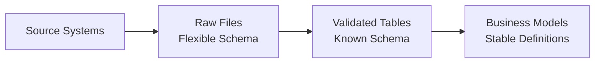

The real design question is not “warehouse or lake?” It is which storage and governance pattern best fits each stage of the data lifecycle.

---

## Medallion Architecture

The **medallion architecture** organizes data into progressively cleaner and more useful layers.

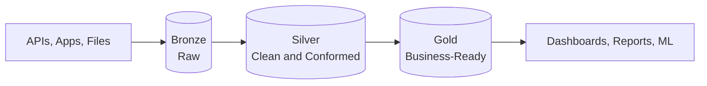

### Bronze Layer

The bronze layer keeps source data close to its original form.

Typical work:

* Add ingestion timestamps and source metadata.
* Preserve original values.
* Append new records.
* Quarantine unreadable files or malformed records.
* Avoid applying changing business rules too early.

The bronze layer makes pipelines auditable and supports reprocessing.

### Silver Layer

The silver layer contains validated and standardized data.

Typical work:

* Cast values to correct types.
* Normalize timestamps and time zones.
* Deduplicate records.
* Handle missing values.
* Standardize codes and names.
* Join reference data.
* Enforce data quality rules.

### Gold Layer

The gold layer contains business-ready datasets.

Typical work:

* Build fact and dimension tables.
* Calculate approved metrics.
* Aggregate data to useful grains.
* Apply business definitions.
* Optimize tables for dashboards and recurring analysis.

### Important Principle

Bronze, silver, and gold describe **data quality and purpose**, not specific products. The layers can be implemented with schemas, databases, folders, tables, views, or a combination.

---

## Cloud-Based Data Warehouses

A cloud data warehouse provides analytical storage and compute as a managed service.

Common characteristics:

* Elastic or independently scalable compute.
* Managed storage and infrastructure.
* Usage-based pricing.
* High availability and recovery features.
* SQL access and integrations with BI tools.
* Centralized security and governance.

Cloud services reduce infrastructure work, but engineers still need to manage:

* Cost.
* Warehouse sizing.
* Query efficiency.
* Roles and privileges.
* Data quality.
* Lifecycle and retention.

---

# Part 2 - Snowflake Foundations

## Snowflake Architecture

Snowflake separates its architecture into three logical layers:

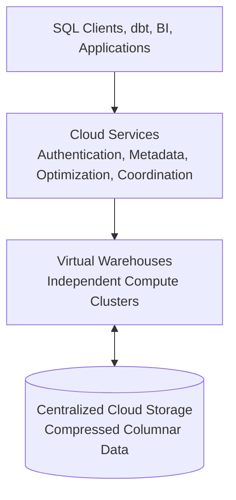

### Storage Layer

Snowflake stores table data in managed cloud storage. It handles organization, compression, metadata, and internal storage layout.

Important ideas:

* Storage persists independently of a warehouse.
* Suspending a warehouse does not delete table data.
* Multiple warehouses can query the same stored data.
* Snowflake manages the internal files and micro-partitions.

### Compute Layer

A **virtual warehouse** is a compute cluster that runs queries and data manipulation operations.

Warehouses can be:

* Started and suspended.
* Resized.
* Assigned to different workloads.
* Configured for automatic suspension and resumption.
* Scaled for concurrency with multi-cluster options where supported.

Separating workloads can reduce interference:

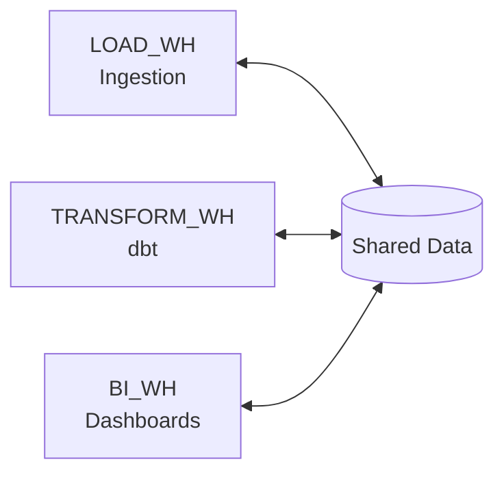

### Cloud Services Layer

The cloud services layer coordinates Snowflake activity, including:

* Authentication and access control.
* Metadata management.
* SQL parsing and query optimization.
* Transaction management.
* Query dispatch and infrastructure coordination.

### Snowflake Object Hierarchy

```text
Account
└── Database
    └── Schema
        ├── Tables
        ├── Views
        ├── Stages
        ├── File formats
        ├── Pipes
        ├── Streams
        ├── Tasks
        └── Functions
```

A warehouse is an account-level compute object. It is not stored inside a database or schema.

---

## Context and Fully Qualified Names

Snowflake sessions have an active role, warehouse, database, and schema.

```sql
USE ROLE SYSADMIN;
USE WAREHOUSE TRANSFORM_WH;
USE DATABASE STREAMFLOW;
USE SCHEMA RAW;
```

A fully qualified object name removes ambiguity:

```sql
SELECT *
FROM STREAMFLOW.RAW.EVENTS;
```

The three parts are:

```text
database.schema.object
```

Useful context commands:

```sql
SELECT CURRENT_ROLE();
SELECT CURRENT_WAREHOUSE();
SELECT CURRENT_DATABASE();
SELECT CURRENT_SCHEMA();
```

Many “object does not exist” errors are actually context or privilege problems.

---

## Creating Core Snowflake Objects

### Warehouse

```sql
CREATE WAREHOUSE IF NOT EXISTS TRANSFORM_WH
  WAREHOUSE_SIZE = 'XSMALL'
  AUTO_SUSPEND = 60
  AUTO_RESUME = TRUE
  INITIALLY_SUSPENDED = TRUE;
```

`AUTO_SUSPEND` helps control cost by stopping idle compute. `AUTO_RESUME` restarts it when work arrives.

### Database and Schemas

```sql
CREATE DATABASE IF NOT EXISTS STREAMFLOW;

CREATE SCHEMA IF NOT EXISTS STREAMFLOW.RAW;
CREATE SCHEMA IF NOT EXISTS STREAMFLOW.STAGING;
CREATE SCHEMA IF NOT EXISTS STREAMFLOW.ANALYTICS;
```

Schemas provide namespaces and can represent teams, data domains, or medallion layers.

### Table

```sql
CREATE OR REPLACE TABLE STREAMFLOW.RAW.EVENTS (
    EVENT_ID VARCHAR NOT NULL,
    EVENT_TYPE VARCHAR,
    USER_ID VARCHAR,
    EVENT_TS TIMESTAMP_TZ,
    SOURCE VARCHAR,
    PAYLOAD VARIANT,
    INGESTED_AT TIMESTAMP_TZ DEFAULT CURRENT_TIMESTAMP()
);
```

Common data types:

| Type | Use |
| --- | --- |
| `VARCHAR` | Text |
| `NUMBER(p,s)` | Numeric values and fixed-point decimals |
| `FLOAT` | Approximate numeric values |
| `BOOLEAN` | True/false |
| `DATE` | Calendar date |
| `TIME` | Time of day |
| `TIMESTAMP_NTZ` | Timestamp without time-zone semantics |
| `TIMESTAMP_TZ` | Timestamp with a stored time-zone offset |
| `VARIANT` | Semi-structured values |
| `ARRAY` | Ordered collection |
| `OBJECT` | Key-value object |

Use `NUMBER`, not floating point, for money when exact decimal arithmetic matters.

### Create Table As Select

```sql
CREATE OR REPLACE TABLE STREAMFLOW.STAGING.CLEAN_EVENTS AS
SELECT
    EVENT_ID,
    LOWER(EVENT_TYPE) AS EVENT_TYPE,
    USER_ID,
    EVENT_TS,
    SOURCE,
    PAYLOAD
FROM STREAMFLOW.RAW.EVENTS
WHERE EVENT_ID IS NOT NULL;
```

This pattern is called **CTAS**: Create Table As Select.

---

## Tables and Views

### Tables

A table stores data.

```sql
INSERT INTO STREAMFLOW.RAW.EVENTS (
    EVENT_ID, EVENT_TYPE, USER_ID, EVENT_TS, SOURCE, PAYLOAD
)
SELECT
    'evt_001',
    'page_view',
    'user_101',
    '2026-07-20T14:00:00Z'::TIMESTAMP_TZ,
    'web',
    PARSE_JSON('{"page":"/home"}');
```

### Views

A standard view stores a query definition, not a separate copy of its result.

```sql
CREATE OR REPLACE VIEW STREAMFLOW.ANALYTICS.PURCHASE_EVENTS AS
SELECT
    EVENT_ID,
    USER_ID,
    EVENT_TS,
    PAYLOAD:amount::NUMBER(12, 2) AS AMOUNT
FROM STREAMFLOW.RAW.EVENTS
WHERE EVENT_TYPE = 'purchase';
```

### Table vs View

| Feature | Table | View |
| --- | --- | --- |
| Stores rows | Yes | Stores query definition |
| Freshness | Changes when loaded or transformed | Reflects underlying data when queried |
| Query work | Often less repeated computation | Runs underlying query |
| Best for | Persistent datasets and expensive results | Reusable logic and controlled interfaces |

Use views for simple reusable logic. Materialize expensive or frequently reused transformations when the performance and cost tradeoff justify it.

---

## File Formats

A Snowflake **file format** describes how staged files should be interpreted.

### CSV Format

```sql
CREATE OR REPLACE FILE FORMAT STREAMFLOW.RAW.CSV_FORMAT
  TYPE = CSV
  FIELD_DELIMITER = ','
  SKIP_HEADER = 1
  FIELD_OPTIONALLY_ENCLOSED_BY = '"'
  NULL_IF = ('', 'NULL')
  EMPTY_FIELD_AS_NULL = TRUE;
```

### JSON Format

```sql
CREATE OR REPLACE FILE FORMAT STREAMFLOW.RAW.JSON_FORMAT
  TYPE = JSON
  STRIP_OUTER_ARRAY = FALSE;
```

Common supported formats include CSV, JSON, Avro, ORC, Parquet, and XML. Format options differ by type.

Named file formats promote consistency because the same parsing configuration can be reused by stages, `COPY INTO`, and pipes.

---

## Stages

A **stage** is a location where files are available for loading or unloading.

### Stage Types

| Stage | Description |
| --- | --- |
| User stage | Automatically available for each user |
| Table stage | Automatically associated with a table |
| Named internal stage | Reusable storage managed inside Snowflake |
| Named external stage | Reference to S3, Azure, or Google Cloud Storage |

### Internal Stage

```sql
CREATE OR REPLACE STAGE STREAMFLOW.RAW.EVENT_STAGE
  FILE_FORMAT = STREAMFLOW.RAW.JSON_FORMAT;
```

List files:

```sql
LIST @STREAMFLOW.RAW.EVENT_STAGE;
```

Upload from SnowSQL:

```sql
PUT file://C:/data/events/*.json
  @STREAMFLOW.RAW.EVENT_STAGE
  AUTO_COMPRESS = TRUE;
```

### External Stage

```sql
CREATE OR REPLACE STAGE STREAMFLOW.RAW.S3_EVENT_STAGE
  URL = 's3://example-streamflow/events/'
  STORAGE_INTEGRATION = STREAMFLOW_S3_INT
  FILE_FORMAT = STREAMFLOW.RAW.JSON_FORMAT;
```

Prefer a storage integration over embedding cloud credentials in SQL.

---

## Bulk Data Loading

Bulk loading normally follows this path:

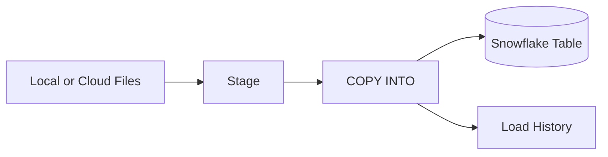

### Load JSON

```sql
COPY INTO STREAMFLOW.RAW.EVENTS (
    EVENT_ID,
    EVENT_TYPE,
    USER_ID,
    EVENT_TS,
    SOURCE,
    PAYLOAD
)
FROM (
    SELECT
        $1:event_id::VARCHAR,
        $1:event_type::VARCHAR,
        $1:user_id::VARCHAR,
        $1:event_ts::TIMESTAMP_TZ,
        $1:source::VARCHAR,
        $1:payload
    FROM @STREAMFLOW.RAW.EVENT_STAGE
)
FILE_FORMAT = (FORMAT_NAME = STREAMFLOW.RAW.JSON_FORMAT)
ON_ERROR = 'ABORT_STATEMENT';
```

### Load CSV

```sql
COPY INTO STREAMFLOW.RAW.CUSTOMERS
FROM @STREAMFLOW.RAW.CUSTOMER_STAGE
FILE_FORMAT = (FORMAT_NAME = STREAMFLOW.RAW.CSV_FORMAT)
MATCH_BY_COLUMN_NAME = CASE_INSENSITIVE
ON_ERROR = 'ABORT_STATEMENT';
```

### Validate Before Loading

```sql
COPY INTO STREAMFLOW.RAW.EVENTS
FROM @STREAMFLOW.RAW.EVENT_STAGE
FILE_FORMAT = (FORMAT_NAME = STREAMFLOW.RAW.JSON_FORMAT)
VALIDATION_MODE = 'RETURN_ERRORS';
```

Use validation mode to inspect parsing problems without committing rows.

### Load Metadata

Snowflake exposes staged-file metadata fields that can improve lineage:

```sql
SELECT
    METADATA$FILENAME,
    METADATA$FILE_ROW_NUMBER,
    $1
FROM @STREAMFLOW.RAW.EVENT_STAGE;
```

Persisting source filename, row number, and load timestamp can make failures easier to trace.

---

## SnowSQL Basic Operations

**SnowSQL** is Snowflake's command-line client for executing SQL and file transfer commands.

### Connect

```bash
snowsql -a <account_identifier> -u <username>
```

Connection properties can be stored in a SnowSQL configuration file. Do not commit passwords, private keys, or tokens.

### Useful Commands

```sql
!help
!quit
!set output_format=table
!source setup.sql
```

Run a command from the shell:

```bash
snowsql -q "SELECT CURRENT_VERSION();"
```

Run a SQL file:

```bash
snowsql -f setup.sql
```

### Object Discovery

```sql
SHOW WAREHOUSES;
SHOW DATABASES;
SHOW SCHEMAS IN DATABASE STREAMFLOW;
SHOW TABLES IN SCHEMA STREAMFLOW.RAW;
SHOW STAGES IN SCHEMA STREAMFLOW.RAW;

DESCRIBE TABLE STREAMFLOW.RAW.EVENTS;
```

---

## Querying Data

### Basic Query

```sql
SELECT
    EVENT_TYPE,
    COUNT(*) AS EVENT_COUNT,
    COUNT(DISTINCT USER_ID) AS UNIQUE_USERS
FROM STREAMFLOW.RAW.EVENTS
WHERE EVENT_TS >= DATEADD('day', -7, CURRENT_TIMESTAMP())
GROUP BY EVENT_TYPE
ORDER BY EVENT_COUNT DESC;
```

### Useful Snowflake SQL Features

```sql
-- Filter after a window function without an extra subquery.
SELECT
    EVENT_ID,
    USER_ID,
    EVENT_TS,
    ROW_NUMBER() OVER (
        PARTITION BY EVENT_ID
        ORDER BY INGESTED_AT DESC
    ) AS ROW_NUM
FROM STREAMFLOW.RAW.EVENTS
QUALIFY ROW_NUM = 1;
```

```sql
-- Insert or update from a source dataset.
MERGE INTO STREAMFLOW.STAGING.USERS AS target
USING STREAMFLOW.RAW.USER_UPDATES AS source
    ON target.USER_ID = source.USER_ID
WHEN MATCHED THEN UPDATE SET
    target.EMAIL = source.EMAIL,
    target.UPDATED_AT = source.UPDATED_AT
WHEN NOT MATCHED THEN INSERT (
    USER_ID, EMAIL, UPDATED_AT
) VALUES (
    source.USER_ID, source.EMAIL, source.UPDATED_AT
);
```

`QUALIFY` filters window-function results. `MERGE` supports idempotent upsert patterns when its source and match key are well defined.

---

## Querying Semi-Structured Data

Snowflake's `VARIANT` type can store semi-structured values such as JSON.

### Parse JSON

```sql
SELECT PARSE_JSON(
    '{"event_type":"purchase","amount":49.99}'
) AS EVENT;
```

### Access Object Fields

```sql
SELECT
    PAYLOAD:page::VARCHAR AS PAGE,
    PAYLOAD:amount::NUMBER(12, 2) AS AMOUNT
FROM STREAMFLOW.RAW.EVENTS;
```

The colon navigates into a `VARIANT`. The cast converts the result to a relational SQL type.

### Nested Values

```sql
SELECT
    PAYLOAD:device.os::VARCHAR AS DEVICE_OS,
    PAYLOAD:campaign.id::VARCHAR AS CAMPAIGN_ID
FROM STREAMFLOW.RAW.EVENTS;
```

### Flatten Arrays

For a value such as:

```json
{
  "order_id": "ord_101",
  "items": [
    {"sku": "sku_a", "quantity": 2},
    {"sku": "sku_b", "quantity": 1}
  ]
}
```

Use `FLATTEN`:

```sql
SELECT
    ORDER_DATA:order_id::VARCHAR AS ORDER_ID,
    ITEM.VALUE:sku::VARCHAR AS SKU,
    ITEM.VALUE:quantity::NUMBER AS QUANTITY
FROM STREAMFLOW.RAW.ORDERS,
LATERAL FLATTEN(INPUT => ORDER_DATA:items) AS ITEM;
```

### Semi-Structured Data Strategy

Use `VARIANT` to preserve changing source payloads, then expose stable typed columns for important fields.

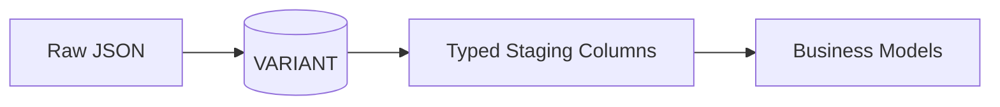

Do not force every consumer to repeat parsing and casting logic.

---

## User-Defined Functions

A **user-defined function**, or UDF, packages reusable logic that returns one value for each input row.

### SQL UDF

```sql
CREATE OR REPLACE FUNCTION STREAMFLOW.ANALYTICS.NORMALIZE_SOURCE(
    SOURCE_VALUE VARCHAR
)
RETURNS VARCHAR
LANGUAGE SQL
AS
$$
    CASE
        WHEN LOWER(TRIM(SOURCE_VALUE)) IN ('ios', 'android') THEN 'mobile'
        WHEN LOWER(TRIM(SOURCE_VALUE)) IN ('website', 'browser') THEN 'web'
        ELSE LOWER(TRIM(SOURCE_VALUE))
    END
$$;
```

Use it like a built-in function:

```sql
SELECT
    EVENT_ID,
    STREAMFLOW.ANALYTICS.NORMALIZE_SOURCE(SOURCE) AS CLEAN_SOURCE
FROM STREAMFLOW.RAW.EVENTS;
```

### UDF Guidance

Use a UDF when logic is:

* Repeated in many queries.
* Naturally expressed as a function.
* Easier to test and govern centrally.

Avoid hiding simple transformations behind many layers of functions. A normal SQL expression or dbt model may be clearer.

---

## Snowpipe

**Snowpipe** continuously loads files from a stage in small batches. A pipe stores a `COPY INTO` definition.

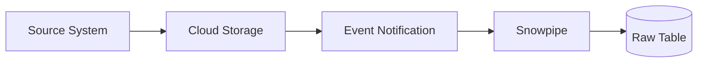

### Create a Pipe

```sql
CREATE OR REPLACE PIPE STREAMFLOW.RAW.EVENT_PIPE
  AUTO_INGEST = TRUE
AS
COPY INTO STREAMFLOW.RAW.EVENTS
FROM @STREAMFLOW.RAW.S3_EVENT_STAGE
FILE_FORMAT = (FORMAT_NAME = STREAMFLOW.RAW.JSON_FORMAT)
ON_ERROR = 'SKIP_FILE';
```

### Bulk `COPY INTO` vs Snowpipe

| Feature | Bulk `COPY INTO` | Snowpipe |
| --- | --- | --- |
| Trigger | Scheduled or manually invoked | File notification or API submission |
| Compute | User-managed virtual warehouse | Snowflake-managed serverless compute |
| Workload | Larger planned batches | Frequent small file batches |
| Latency | Depends on schedule | Usually near-continuous file ingestion |
| Control | Explicit batch execution | Automated ingestion |

Snowpipe is file-based ingestion. **Snowpipe Streaming** is a separate option for continuous row-based ingestion without first staging files.

### Monitor

```sql
SELECT SYSTEM$PIPE_STATUS('STREAMFLOW.RAW.EVENT_PIPE');
```

```sql
SELECT *
FROM TABLE(
    INFORMATION_SCHEMA.COPY_HISTORY(
        TABLE_NAME => 'STREAMFLOW.RAW.EVENTS',
        START_TIME => DATEADD('hour', -1, CURRENT_TIMESTAMP())
    )
);
```

---

## Data Loading Best Practices

### File Design

* Prefer compressed files.
* Avoid huge numbers of tiny files.
* Keep file sizes reasonably consistent.
* Separate prefixes or paths by dataset.
* Do not overwrite files with the same name as a normal ingestion strategy.

### Reliability

* Keep a stable event or business key.
* Capture load timestamps and source filenames.
* Validate files before production loads.
* Quarantine rejected records.
* Monitor load history and alert on errors.
* Make downstream transformations idempotent.

### Security

* Use least-privilege roles.
* Use storage integrations for external stages.
* Keep credentials out of SQL and Git.
* Separate administrative, loading, transformation, and reporting roles.

### Cost and Performance

* Enable auto-suspend and auto-resume.
* Use a dedicated warehouse for ingestion or transformation when isolation helps.
* Size warehouses for measured workloads rather than guessing.
* Avoid repeatedly parsing the same JSON in every dashboard query.
* Use query history and profiles to identify expensive operations.

---

## Streams and Tasks

Streams and tasks can implement incremental transformations inside Snowflake.

### Stream

A **stream** records change-tracking information for a source object. It exposes row changes since the stream's current offset.

```sql
CREATE OR REPLACE STREAM STREAMFLOW.RAW.EVENTS_STREAM
ON TABLE STREAMFLOW.RAW.EVENTS;
```

Query the stream:

```sql
SELECT
    EVENT_ID,
    EVENT_TYPE,
    METADATA$ACTION,
    METADATA$ISUPDATE
FROM STREAMFLOW.RAW.EVENTS_STREAM;
```

A stream is not a second full copy of the table. It uses change-tracking metadata to expose a delta.

### Task

A **task** runs SQL or a procedure according to a schedule or dependency.

```sql
CREATE OR REPLACE TASK STREAMFLOW.STAGING.PROCESS_EVENTS
  WAREHOUSE = TRANSFORM_WH
  SCHEDULE = '5 MINUTE'
  WHEN SYSTEM$STREAM_HAS_DATA('STREAMFLOW.RAW.EVENTS_STREAM')
AS
MERGE INTO STREAMFLOW.STAGING.EVENTS AS target
USING STREAMFLOW.RAW.EVENTS_STREAM AS source
    ON target.EVENT_ID = source.EVENT_ID
WHEN MATCHED THEN UPDATE SET
    target.EVENT_TYPE = source.EVENT_TYPE,
    target.EVENT_TS = source.EVENT_TS,
    target.SOURCE = source.SOURCE
WHEN NOT MATCHED THEN INSERT (
    EVENT_ID, EVENT_TYPE, EVENT_TS, SOURCE
) VALUES (
    source.EVENT_ID, source.EVENT_TYPE, source.EVENT_TS, source.SOURCE
);
```

New tasks begin suspended:

```sql
ALTER TASK STREAMFLOW.STAGING.PROCESS_EVENTS RESUME;
```

Suspend before modifying:

```sql
ALTER TASK STREAMFLOW.STAGING.PROCESS_EVENTS SUSPEND;
```

### Pipeline Pattern

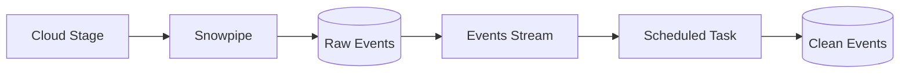

Important: consuming a stream in DML advances its offset when the transaction commits. Design retry and failure handling carefully.

---

## Database Replication

Replication copies supported Snowflake objects and data from a source account to a target account, commonly for disaster recovery, business continuity, or regional access.

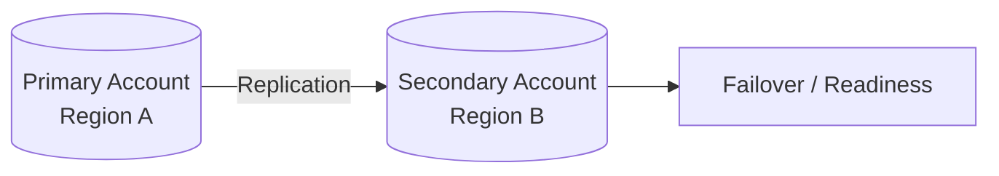

### Replication Is Not a Backup Strategy by Itself

Replication can copy unwanted changes as well as good ones. A complete recovery strategy may combine:

* Replication and failover.
* Time Travel.
* Fail-safe behavior where applicable.
* Retained raw source data.
* Tested recovery procedures.

### Questions to Answer

* Which databases and account objects must be available after a regional failure?
* How frequently should the replica refresh?
* What recovery point objective is acceptable?
* What recovery time objective is acceptable?
* Who is authorized to promote or fail back?
* Are integrations, network rules, and secrets available in the target environment?

Always test failover procedures. A replica that has never been exercised is an assumption, not a recovery plan.

---

# Part 3 - dbt Foundations

## Introduction to dbt

**dbt** helps data teams transform data inside a warehouse using SQL, templating, testing, documentation, and software engineering practices.

dbt commonly owns the **T** in ELT:

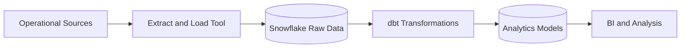

dbt does not usually extract files from applications or act as the data warehouse. It compiles model code into SQL and runs that SQL against the configured data platform.

### Why dbt?

dbt brings analytics logic into a development workflow:

* SQL files in version control.
* Reusable dependencies.
* Automated data tests.
* Generated documentation.
* Data lineage.
* Separate development and production targets.
* Modular transformations instead of one giant query.

### Analytics Engineering

Analytics engineering sits between raw data ingestion and data consumption. It focuses on creating tested, documented, reusable datasets that accurately represent business concepts.

---

## dbt Project Structure

A typical project looks like:

```text
streamflow_analytics/
├── dbt_project.yml
├── packages.yml
├── models/
│   ├── staging/
│   │   ├── sources.yml
│   │   ├── stg_streamflow__events.sql
│   │   └── staging.yml
│   ├── intermediate/
│   │   └── int_events_enriched.sql
│   └── marts/
│       ├── fct_events.sql
│       ├── dim_users.sql
│       └── marts.yml
├── seeds/
│   └── event_type_mapping.csv
├── snapshots/
│   └── users_snapshot.sql
├── macros/
├── tests/
└── analyses/
```

### Important Resources

| Resource | Purpose |
| --- | --- |
| Model | SQL `SELECT` statement materialized in the warehouse |
| Source | Declared external/raw table loaded outside dbt |
| Seed | Small CSV file loaded by dbt |
| Snapshot | Tracks changes to mutable source records over time |
| Test | Assertion about data or project structure |
| Macro | Reusable Jinja-based SQL generation |
| Analysis | SQL that compiles but is not materialized as a model |

### `dbt_project.yml`

This file identifies the project and configures paths and default behavior.

```yaml
name: streamflow_analytics
version: 1.0.0
config-version: 2

profile: streamflow_analytics

model-paths: ["models"]
seed-paths: ["seeds"]
snapshot-paths: ["snapshots"]
test-paths: ["tests"]
macro-paths: ["macros"]

models:
  streamflow_analytics:
    staging:
      +materialized: view
    intermediate:
      +materialized: ephemeral
    marts:
      +materialized: table
```

YAML indentation is significant.

### Profile and Credentials

Connection credentials are configured separately from project code, commonly in a profile or managed environment.

Do not commit:

* Passwords.
* Private keys.
* Access tokens.
* Production account secrets.

Use environment variables or a secrets manager where appropriate.

---

## dbt Models

A dbt model is usually one `.sql` file containing one final `SELECT` statement.

```sql
-- models/staging/stg_streamflow__events.sql

select
    event_id,
    lower(trim(event_type)) as event_type,
    user_id,
    event_ts::timestamp_tz as event_ts,
    lower(trim(source)) as source,
    payload,
    ingested_at
from {{ source('streamflow_raw', 'events') }}
where event_id is not null
```

dbt compiles the Jinja expressions and submits executable SQL to Snowflake.

### Materializations

| Materialization | Result | Typical Use |
| --- | --- | --- |
| `view` | Warehouse view | Lightweight staging logic |
| `table` | Rebuilt physical table | Marts or expensive stable results |
| `incremental` | Processes selected new/changed rows | Large datasets |
| `ephemeral` | Inlined as a CTE into dependent models | Small intermediate logic |

Materialization is a performance, cost, and maintainability decision—not only a syntax choice.

Model-level configuration:

```sql
{{ config(materialized='table') }}

select ...
```

Prefer project- or directory-level defaults when many models share the same setting.

---

## Sources

A dbt **source** describes a table loaded by a system outside the current dbt project.

```yaml
version: 2

sources:
  - name: streamflow_raw
    database: STREAMFLOW
    schema: RAW
    description: Raw StreamFlow application data.
    tables:
      - name: events
        description: One row per received application event.
        loaded_at_field: ingested_at
        columns:
          - name: event_id
            tests:
              - not_null
              - unique
```

Reference it in a model:

```sql
select *
from {{ source('streamflow_raw', 'events') }}
```

Benefits:

* Creates lineage from raw data.
* Centralizes physical database and schema names.
* Supports source documentation.
* Enables source testing and freshness checks.

Avoid hard-coding `STREAMFLOW.RAW.EVENTS` throughout every model.

---

## `ref()` and Model Dependencies

`ref()` points to another dbt model:

```sql
select *
from {{ ref('stg_streamflow__events') }}
```

`ref()` does two important jobs:

1. Resolves the correct physical relation for the current target.
2. Adds an edge to dbt's dependency graph.

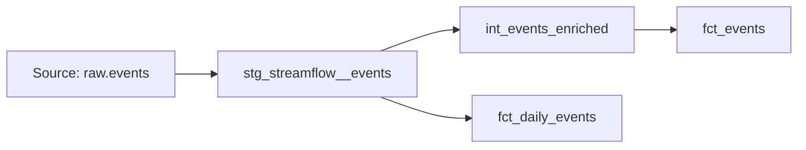

That graph lets dbt build models in dependency order.

### `source()` vs `ref()`

| Function | Points To | Example |
| --- | --- | --- |
| `source()` | Data loaded outside the project | Raw application table |
| `ref()` | A dbt model, seed, or snapshot | Staging or mart model |

---

## Staging Models

Staging models create a clean, consistent interface over raw source tables.

Good staging work includes:

* Renaming columns.
* Casting types.
* Standardizing nulls and booleans.
* Normalizing simple codes.
* Selecting only needed fields.
* Extracting commonly used JSON attributes.

Avoid heavy business logic and large multi-source joins in staging.

### Example

```sql
with source as (

    select *
    from {{ source('streamflow_raw', 'events') }}

),

renamed as (

    select
        event_id,
        lower(trim(event_type)) as event_type,
        user_id,
        event_ts::timestamp_tz as event_at,
        lower(trim(source)) as source,
        payload:page::varchar as page_path,
        payload:amount::number(12, 2) as purchase_amount,
        ingested_at
    from source

)

select *
from renamed
```

A common naming pattern is:

```text
stg_<source_system>__<entity>
```

For example:

```text
stg_streamflow__events
stg_stripe__payments
stg_salesforce__accounts
```

---

## Intermediate and Mart Models

### Intermediate Models

Intermediate models break complex transformations into understandable steps.

```sql
-- models/intermediate/int_events_enriched.sql

select
    events.*,
    users.signup_at,
    users.marketing_channel
from {{ ref('stg_streamflow__events') }} as events
left join {{ ref('stg_streamflow__users') }} as users
    on events.user_id = users.user_id
```

### Mart Models

Mart models expose business-ready facts, dimensions, and aggregates.

```sql
-- models/marts/fct_daily_events.sql

select
    date_trunc('day', event_at) as event_date,
    event_type,
    source,
    count(*) as event_count,
    count(distinct user_id) as unique_users
from {{ ref('int_events_enriched') }}
group by 1, 2, 3
```

### Layer Responsibilities

| Layer | Main Responsibility |
| --- | --- |
| Source | Describe externally loaded data |
| Staging | Clean and standardize one source entity |
| Intermediate | Combine or reshape reusable logic |
| Marts | Present business concepts and metrics |

---

## Seeds

A **seed** is a small CSV file stored in the project and loaded into the warehouse.

Example:

```csv
event_type,event_category
page_view,engagement
video_play,engagement
add_to_cart,commerce
purchase,commerce
```

Load seeds:

```bash
dbt seed
```

Reference one:

```sql
select *
from {{ ref('event_type_mapping') }}
```

Good seed use cases:

* Small, slowly changing code mappings.
* Static reference lists.
* Test fixtures.

Seeds are not a replacement for a production ingestion process or a large operational dataset.

---

## Tests

dbt tests turn data expectations into executable checks.

### Generic Data Tests

```yaml
version: 2

models:
  - name: fct_events
    description: One row per valid StreamFlow event.
    columns:
      - name: event_id
        tests:
          - not_null
          - unique

      - name: event_type
        tests:
          - accepted_values:
              values:
                - page_view
                - video_play
                - video_pause
                - add_to_cart
                - purchase

      - name: user_id
        tests:
          - relationships:
              to: ref('dim_users')
              field: user_id
```

### Singular Data Test

A singular test is a SQL query that returns failing rows.

```sql
-- tests/assert_purchase_amount_is_positive.sql

select *
from {{ ref('fct_events') }}
where event_type = 'purchase'
  and purchase_amount <= 0
```

The test passes when the query returns zero rows.

### Testing Principle

Test important assumptions at the layer where they become meaningful. A source test monitors incoming data; a mart test protects a business-facing contract.

---

## Snapshots

Snapshots preserve the history of mutable records, often using a slowly changing dimension Type 2 pattern.

Example use case:

```text
user_101 changed plan from basic to premium
```

Without history, an update overwrites the previous plan. A snapshot can preserve both versions with validity timestamps.

Use snapshots for mutable source tables when historical state matters. Do not snapshot append-only event facts just because snapshots exist.

---

## Documentation and Lineage

Document models and columns in YAML:

```yaml
version: 2

models:
  - name: fct_daily_events
    description: Daily event metrics by type and source.
    columns:
      - name: event_date
        description: UTC calendar date on which the event occurred.
      - name: event_count
        description: Number of valid events in the group.
      - name: unique_users
        description: Distinct non-null user IDs in the group.
```

Generate and view documentation:

```bash
dbt docs generate
dbt docs serve
```

Useful documentation explains:

* Grain: what one row represents.
* Business meaning.
* Important filters and exclusions.
* Time-zone and timestamp semantics.
* Ownership and freshness expectations.

---

## Common dbt Commands

| Command | Purpose |
| --- | --- |
| `dbt debug` | Check project configuration and connection |
| `dbt parse` | Parse project files and validate project structure |
| `dbt compile` | Render Jinja into executable SQL |
| `dbt run` | Build selected models |
| `dbt test` | Execute data tests |
| `dbt build` | Build and test selected resources in dependency order |
| `dbt seed` | Load seed CSV files |
| `dbt snapshot` | Execute snapshots |
| `dbt docs generate` | Build catalog and documentation artifacts |

### Selection Syntax

```bash
dbt build --select fct_daily_events
dbt build --select +fct_daily_events
dbt build --select fct_daily_events+
dbt build --select tag:daily
```

At a high level:

* Leading `+` includes ancestors.
* Trailing `+` includes descendants.

Selection makes development faster and supports focused production jobs.

---

## End-to-End Snowflake and dbt Workflow

```mermaid
flowchart LR
    app[Applications] --> files[Cloud Files]
    files --> snowpipe[Snowpipe]
    snowpipe --> raw[(RAW.EVENTS)]
    raw --> source[dbt source()]
    source --> staging[Staging Models]
    staging --> intermediate[Intermediate Models]
    intermediate --> marts[Fact and Dimension Models]
    marts --> tests[dbt Tests]
    marts --> bi[BI Dashboards]
```

### Example Build Sequence

1. Files arrive in cloud storage.
2. Snowpipe loads them into `RAW.EVENTS`.
3. A dbt source declares the raw table.
4. A staging model casts and normalizes fields.
5. An intermediate model joins users and event mappings.
6. Fact and aggregate models expose approved grains and metrics.
7. Tests check keys, accepted values, relationships, and business rules.
8. Documentation and lineage help consumers understand the result.

---

## Common Mistakes and Gotchas

| Mistake | Why It Matters | Better Approach |
| --- | --- | --- |
| Leaving a warehouse running | Consumes credits while active | Configure auto-suspend and monitor usage |
| Using one warehouse for every workload | Queries and loads can compete | Separate workloads when isolation is useful |
| Relying on session context | Code can target the wrong object | Use explicit context or qualified names |
| Embedding cloud keys in SQL | Exposes sensitive credentials | Use storage integrations |
| Ignoring load metadata | Bad rows become hard to trace | Store source filename, row number, and load time |
| Loading many tiny files | Creates ingestion overhead | Batch into reasonably sized files |
| Keeping every JSON field only in `VARIANT` | Consumers repeat casts and paths | Promote important fields in staging models |
| Treating a stream as a permanent event log | Stream offsets advance when consumed | Retain durable source data separately |
| Hard-coding raw tables in dbt models | Breaks lineage and environments | Declare sources and use `source()` |
| Hard-coding downstream model names | Bypasses dbt dependency resolution | Use `ref()` |
| Putting joins and business rules in staging | Makes layers harder to reuse | Keep staging focused on source cleanup |
| Using seeds for large changing data | Git and dbt are poor ingestion tools for it | Use a proper load process |
| Writing one giant model | Difficult to test and understand | Build modular staging, intermediate, and mart models |
| Testing only `not_null` | Misses business and relationship failures | Test accepted values, uniqueness, relationships, and rules |
| Committing credentials | Creates a security incident | Use environment variables or secret management |

---

## Review Questions

1. How does a data warehouse differ from a data lake?
2. What responsibilities belong in bronze, silver, and gold layers?
3. What are Snowflake's three main architecture layers?
4. Why can two Snowflake warehouses query the same table without sharing compute?
5. What is the difference between a database, schema, and warehouse?
6. When should you use a table instead of a view?
7. What does a named file format provide?
8. What is the difference between an internal and external stage?
9. How does `COPY INTO` differ from Snowpipe?
10. Why should ingestion record source filenames and load timestamps?
11. How do you access a JSON property stored in a `VARIANT`?
12. What problem does `LATERAL FLATTEN` solve?
13. What is a Snowflake UDF?
14. What does a stream track?
15. What causes a task to run?
16. Why is replication not a complete backup strategy by itself?
17. What role does dbt play in ELT?
18. What is one row in a dbt model supposed to represent?
19. What is the difference between `source()` and `ref()`?
20. What belongs in a staging model?
21. When is a seed appropriate?
22. What does a generic dbt test check?
23. Why does a singular test pass when it returns zero rows?
24. When should a snapshot be used?
25. How does `dbt build` differ from running only `dbt run`?

---

## Quick Knowledge Check

### 1. A dashboard workload slows down while a large ingestion job runs. What Snowflake design can improve isolation?

Use separate virtual warehouses for ingestion and dashboard queries. They can access the same stored data while using independent compute.

### 2. A JSON event contains an array of purchased items. Which Snowflake feature expands the array into rows?

Use `LATERAL FLATTEN`.

### 3. A dbt model reads a table loaded by Fivetran. Should it use `source()` or `ref()`?

Use `source()` because the table is loaded outside the dbt project.

### 4. A dbt model reads a staging model created by the same project. Should it use `source()` or `ref()`?

Use `ref()` so dbt resolves the relation and records the dependency.

### 5. A lookup CSV has 20 stable event categories maintained with the project. Which dbt resource fits?

A seed is appropriate.

### 6. A user table overwrites the current subscription plan, but analysis needs plan history. Which dbt resource fits?

Use a snapshot when the source and strategy meet snapshot requirements.

---

## Summary

| Topic | Key Takeaway |
| --- | --- |
| **Warehouse vs lake** | Warehouses emphasize governed analytics; lakes emphasize flexible large-scale storage |
| **Medallion architecture** | Bronze preserves raw data, silver cleans it, and gold presents business-ready data |
| **Snowflake architecture** | Storage, compute, and cloud services are separated |
| **Virtual warehouse** | Independent compute used for queries, loads, and transformations |
| **Database and schema** | Organize and namespace data objects |
| **Stages and file formats** | Define where load files live and how Snowflake parses them |
| **`COPY INTO`** | Loads staged files in bulk with explicit validation and error behavior |
| **`VARIANT`** | Stores semi-structured values that can be navigated and cast in SQL |
| **Snowpipe** | Continuously loads newly available files with Snowflake-managed compute |
| **Streams and tasks** | Support change-driven, scheduled transformations |
| **Replication** | Copies supported objects for regional access or recovery planning |
| **dbt** | Transforms warehouse data with modular SQL, tests, docs, and lineage |
| **`source()`** | Declares and references externally loaded data |
| **`ref()`** | References project resources and creates dependency edges |
| **Staging model** | Cleans and standardizes one source entity |
| **Seeds and snapshots** | Load small static reference data and preserve mutable record history |

The core Week 9 workflow is: land data safely, preserve its lineage, standardize it once, transform it through explicit dependencies, test the important assumptions, and expose business-ready models that other people can trust.

---

## Official Documentation

* [Snowflake key concepts and architecture](https://docs.snowflake.com/en/user-guide/intro-key-concepts)
* [Snowflake data loading overview](https://docs.snowflake.com/en/user-guide/data-load-overview)
* [Snowflake virtual warehouses](https://docs.snowflake.com/en/user-guide/warehouses)
* [dbt Developer Hub](https://docs.getdbt.com/)
